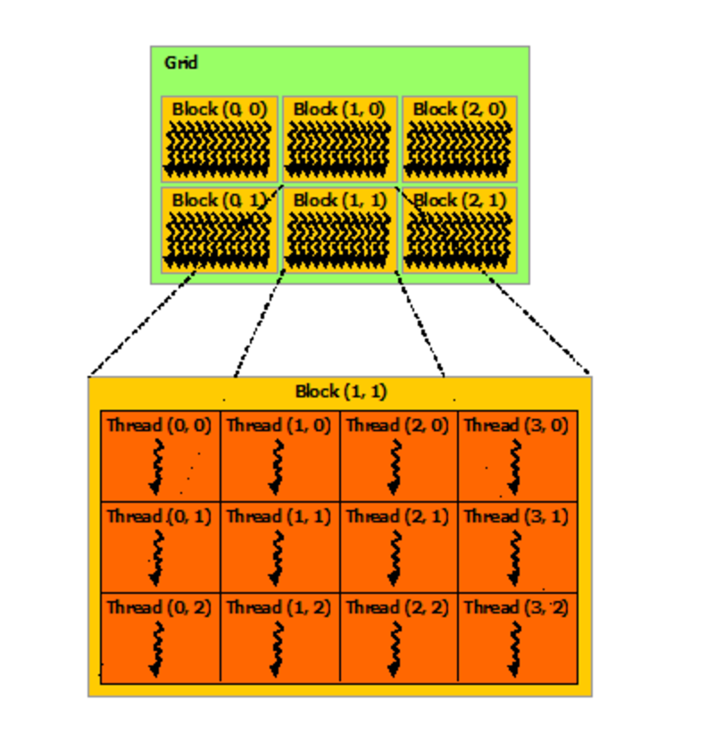
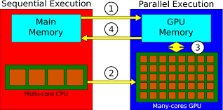
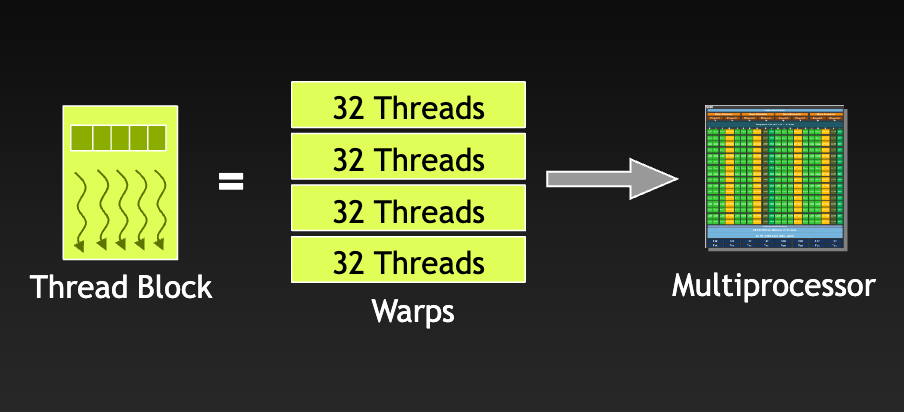
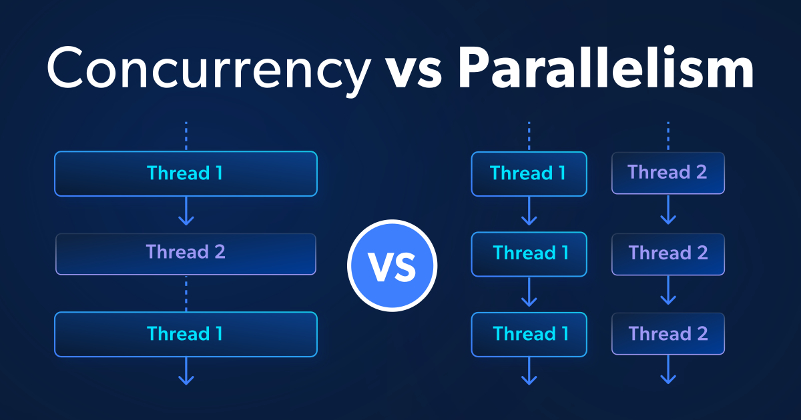

# 20 个 CUDA 核心概念，通俗讲清楚

你训练模型，把它 `to("cuda")`，速度立刻变快。它能跑，但很多人并不知道“到底变快在哪里”。

作者自己也是用 CUDA 一段时间后，才真正理解底层发生了什么。教程通常只教“怎么写”，但不太讲 GPU 实际如何执行。

如果你在用 PyTorch / TensorFlow，或者在 GPU 上跑模型，这篇内容能帮你把关键概念串起来。

## 1. CUDA 到底是什么

CUDA 全称 **Compute Unified Device Architecture**。简单说，它是让你能把代码跑在 GPU 上，而不是 CPU 上的一套平台/编程模型。它由 Nvidia 提供，所以只支持 Nvidia 显卡。很多人说“GPU 编程”，默认其实就是在说 CUDA。


把 CUDA 理解成“你和 GPU 沟通的语言”更直观。没有它，GPU 就只是昂贵但闲着的硬件。

## 2. CPU 和 GPU 的本质差异

- CPU：少量“很聪明”的工人，适合复杂决策和分支逻辑。
- GPU：海量“相对简单”的工人，适合同一类任务大规模并行。

CPU 可能有 8~32 个核心；GPU 可以有成千上万个并行执行单元。对于可并行任务，GPU 会非常快。

## 3. Kernel（核函数）

在 CUDA 里，kernel 就是“跑在 GPU 上的函数”。

你通常在 C++/CUDA 里写它（如 `__global__`），然后从主机端代码发起调用。名字听起来高深，本质就是“GPU 函数”。

在 PyTorch 里你通常看不到 kernel 细节，因为张量加减乘、卷积等操作底层都在发起 CUDA kernel。

## 4. Thread（线程）

一个 kernel 不会只执行一次，而是会并发执行很多次。每一次执行实例就是一个 thread。

可以把一个 thread 看成一个工人，负责一个很小的任务。例如向量相加时，一个线程负责一个元素。

```python
x = torch.randn(10000, device="cuda")
y = torch.randn(10000, device="cuda")

z = x + y
```

这行加法背后会启动大量 CUDA 线程，每个线程处理一个元素。

## 5. Block（线程块）

线程会被组织成 block。

为什么不把线程全丢成一大堆？因为硬件资源有限，CUDA 需要分组调度。一个 block 内的线程可以协作、共享一块快速内存；不同 block 之间通常不能直接通信。

## 6. Grid（网格）

grid 是一次 kernel 启动的“全部 block 集合”。

结构是：`grid -> blocks -> threads`。



可以类比成：城市（grid）- 街区（block）- 住户（thread）。

## 7. Thread ID（线程索引）

所有线程跑的是同一段代码，那怎么分工？靠线程 ID。

每个线程都知道：

- 自己所在 block
- 自己在 block 内的位置

据此就能计算自己要处理的数据下标。

## 8. GPU 内存（Device Memory）

GPU 有自己的显存，与 CPU 的内存（RAM）分离。



数据通常要先从 host memory 拷到 device memory，GPU 才能处理。处理完再拷回去。很多“GPU 代码不快”的根因都在这一步。

## 9. Shared Memory（共享内存）

每个 block 内有一小块很快的共享内存。

它像团队会议室里的白板：同一房间的成员都能读写。比反复访问全局显存快很多。线程间需要复用数据时，shared memory 往往很关键。

## 10. Global Memory（全局内存）

global memory 就是 GPU 的主存储（显存）。

容量大，但相对 shared memory 慢。CUDA 优化很大一部分工作就是：减少对 global memory 的低效访问。

## 11. Memory Coalescing（访存合并）

GPU 从全局内存取数时，喜欢“成块”读取。

如果线程访问模式连续（线程 0 读元素 0，线程 1 读元素 1 ...），就能一次高效抓取，这叫 coalesced access。

如果线程访问分散地址，就会触发更多内存事务，性能会明显下降。

## 12. Warp（线程束）

GPU 调度线程时，不是一个一个线程调度，而是按 32 个线程一组，这组叫 warp。

同一个 warp 的线程通常“锁步执行”。这也是为什么 GPU 上大量分支（`if/else`）会伤性能：如果 warp 内线程走不同分支，硬件往往要分路径串行执行。



这也是 PyTorch 更鼓励向量化张量操作、少写 Python 循环的原因之一。

### 直观案例：为什么有分支会慢

假设一个 warp 有 32 个线程：

- 情况 A：32 个线程都满足 `if`，走同一路径只执行一次，效率高。
- 情况 B：16 个线程走 `if`，16 个线程走 `else`
  GPU 通常要先执行 `if` 路径（另 16 个线程临时闲置），再执行 `else` 路径（前 16 个线程闲置）。

也就是说，本来一次并行能做完的事，变成了两段串行，吞吐会明显下降。
粗略理解：`16/32 + 16/32 = 1` 的“有效工作量”被拆成两次发射，实际效率接近打折（具体还看两条路径长度是否相同）。

### 怎么看 warp 效率

一个实用近似是看“活跃线程占比”：

- 如果某条指令只让 8/32 线程在工作，这步的 warp 利用率大约是 25%；
- 如果大多数指令都出现类似情况，整体性能会被显著拖慢。

工程上常见优化思路：

- 让同一 warp 的线程尽量走同一路径（减少分支分歧）；
- 用向量化/张量操作替代细碎的 Python 条件逻辑；
- 尽量把条件判断提前到数据组织阶段，而不是在热点 kernel 内频繁分叉。

## 13. Occupancy（占用率）

occupancy 可以理解成 GPU 的“忙碌程度”。

如果只用到了可用线程的一部分，硬件就有空闲。更高 occupancy 往往意味着更高吞吐（但不是唯一指标）。

## 14. 内存传输瓶颈

CPU 与 GPU 之间搬数据很贵。

如果 kernel 只算 1ms，但来回拷贝用了 10ms，总体反而变慢。高性能实践通常是：

- 少搬运
- 一旦搬到 GPU 就尽量多做事

在工程里，误用 `.cpu()`、混用 CPU/CUDA tensor 是非常常见的性能坑。

## 15. Parallelism vs Concurrency

两者常被混用，但不同：

- **Concurrency（并发）**：多个任务交替推进
- **Parallelism（并行）**：多个任务同一时刻同时执行

GPU 的价值在于真并行：大量线程同时执行。



## 16. CUDA Streams

默认情况下，CUDA 操作是串行队列执行：拷数据 -> 跑 kernel -> 拷回结果。

stream 允许你重叠这些阶段。例如当前 batch 在计算时，下一批数据可以同时传输，减少空转。

## 17. Synchronization（同步）

kernel 发射后，CPU 通常不会阻塞等待。

但有时你必须确认 GPU 已完成，再继续 CPU 侧逻辑，这就是同步。PyTorch 里常见 `torch.cuda.synchronize()`。

## 18. FLOPS

FLOPS 是每秒浮点运算次数，常用于衡量 GPU 算力。

现代 GPU 可以到 teraFLOPS 量级（每秒万亿次级别）。

## 19. Tensor Cores

新一代 Nvidia GPU 的 tensor core 能高效做小矩阵乘法。

神经网络大量依赖矩阵乘，因此 tensor core 带来巨大收益。混合精度训练（如 float16）通常就是为了更好利用 tensor core。

## 20. cuDNN

CUDA 是基础层，但多数人不会直接手写原生 CUDA 算子。

cuDNN 是 Nvidia 提供的深度学习高性能库，卷积、激活、池化等都做了深度优化。你在 PyTorch 跑卷积时，底层通常就在调用 cuDNN。

很多“框架很快”的体验，来自这些库多年的工程优化积累。

## 真实案例：用矩阵乘法把这些概念串起来

假设我们要计算：

- `A` 的形状是 `(M, N)`
- `B` 的形状是 `(N, K)`
- 输出 `C = A @ B`，形状 `(M, K)`

一个典型 GPU 映射方式是：

- 一个 `thread` 负责计算 `C` 中一个元素（或一小块元素）
- 一组 `thread` 组成 `block`，比如 `16x16=256` 线程
- 很多 `block` 组成 `grid`，覆盖整张输出矩阵

### 这时每个概念怎么落地

1. `Kernel`：就是“算 `C` 的函数”，一次发射，成千上万线程并行执行。  
2. `Thread ID`：每个线程通过 `blockIdx/threadIdx` 算出自己负责的 `C[i,j]`。  
3. `Global Memory`：`A/B/C` 主数据在显存里，容量大但访问慢。  
4. `Shared Memory`：每个 block 先把 `A` 和 `B` 的一个 tile 搬到 shared memory，再复用多次做乘加，减少反复读 global memory。  
5. `Memory Coalescing`：让相邻线程读相邻地址（尤其是读 `A/B` 子块时），提升带宽利用。  
6. `Warp`：32 线程锁步执行。若 kernel 内有分支且 warp 内分叉，会出现分支分歧，吞吐下降。  
7. `Occupancy`：block 太大或寄存器占用太高，会让同时活跃 warp 数下降，GPU 可能吃不满。  
8. `Memory Transfer`：如果每次小计算都在 CPU/GPU 来回拷贝，传输时间可能比计算更久。  
9. `Streams`：可把“下一批数据拷贝”和“当前批矩阵乘”重叠，减少空等。  
10. `Synchronization`：默认异步；要计时或读结果时，显式同步（如 `torch.cuda.synchronize()`）。

### 为什么矩阵乘法常被当作 CUDA 学习主线

- 它天然体现了“并行 + 分块 + 数据复用 + 带宽瓶颈”的全部核心矛盾。  
- Tensor Core、cuBLAS/cuDNN、混合精度优化几乎都能在这个问题上看到效果。  
- 你把 matmul 吃透，卷积、attention 等算子的大部分性能直觉也会跟着建立起来。

### 伪代码：15~20 行 matmul kernel（概念对照版）

```text
kernel matmul_tiled(A, B, C, M, N, K):
  block_m = blockIdx.y            # block 在输出矩阵中的行块坐标
  block_n = blockIdx.x            # block 在输出矩阵中的列块坐标
  ty = threadIdx.y                # 线程在 block 内局部坐标
  tx = threadIdx.x

  row = block_m * BLOCK + ty      # thread -> C[row, col]
  col = block_n * BLOCK + tx
  acc = 0

  for t in range(0, N, BLOCK):    # 沿共享维分块（tiling）
    As[ty, tx] = A[row, t + tx]   # coalesced 读取 A 子块到 shared memory
    Bs[ty, tx] = B[t + ty, col]   # coalesced 读取 B 子块到 shared memory
    __syncthreads()               # block 内同步，确保 tile 已就绪

    for k in range(0, BLOCK):
      acc += As[ty, k] * Bs[k, tx]# 在 shared memory 内复用数据做乘加
    __syncthreads()               # 进入下一 tile 前同步

  if row < M and col < K:
    C[row, col] = acc             # 写回 global memory
```

这段伪代码里：

- `grid/block/thread`：由 `blockIdx/threadIdx` 决定每个线程算哪一个输出元素；
- `shared memory`：`As/Bs` 两个 tile 用于减少 global memory 重复读；
- `synchronization`：两次 `__syncthreads()` 保证块内线程对齐；
- `memory coalescing`：`A[row, t+tx]`、`B[t+ty, col]` 让相邻线程尽量读相邻地址；
- `occupancy/warp 效率`：由 `BLOCK`、寄存器占用、分支行为共同影响。

## 结语

理解这些概念，不要求你马上写 CUDA C++，但会改变你看待问题的方式：

- 读报错时更有方向
- 看性能瓶颈时更有抓手
- 知道模型在 GPU 上到底做了什么

下次写下 `model.to("cuda")`，你可以更清楚地知道：背后是线程调度、warp 执行、内存搬运，以及大量底层库协同在工作。
