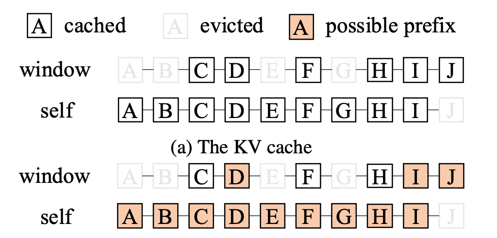
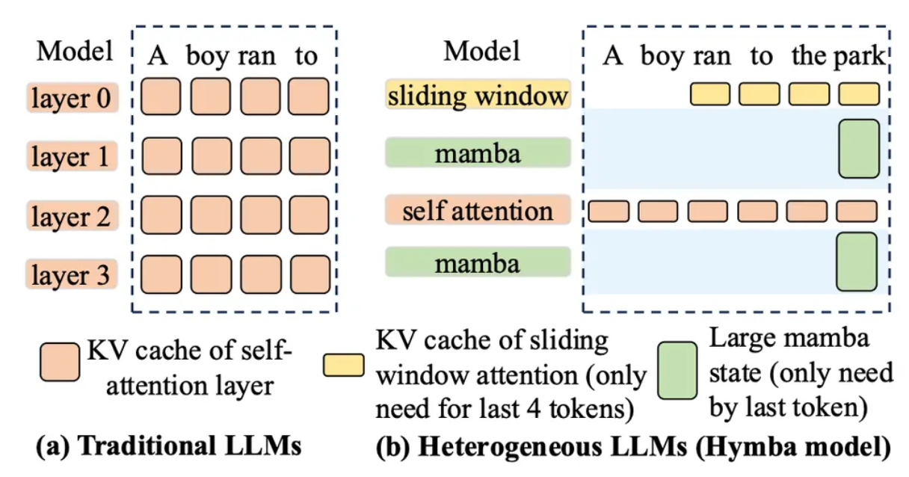
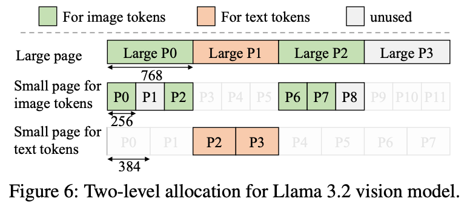
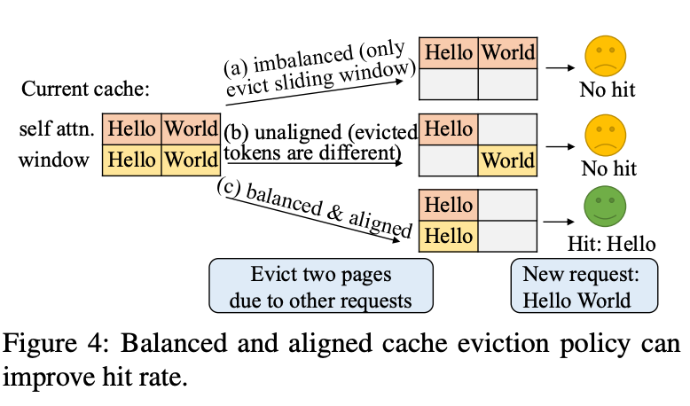
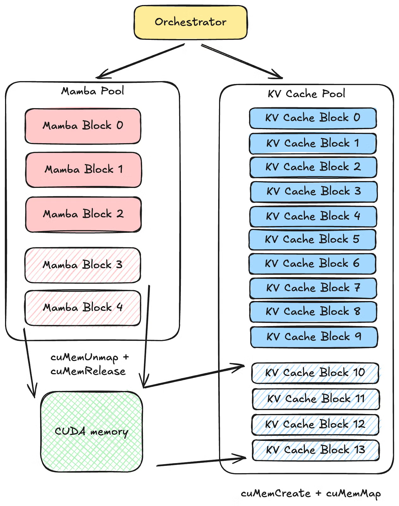
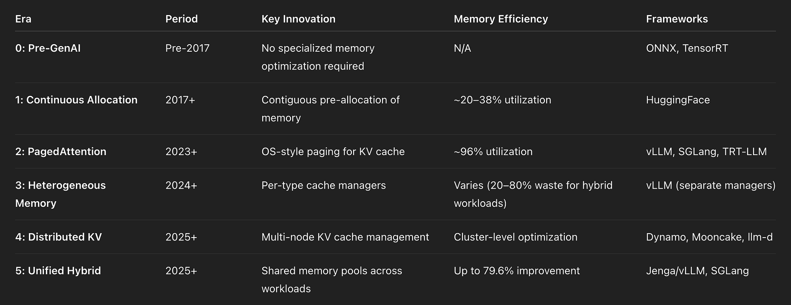

# KV Cache 详解：LLM 推理中 KV Cache 的完整演进指南

> 文章来源翻译整理自：Luv Bansal《KV Cache Explained: The Complete Guide to KV Cache in LLM Inference》
> 原文链接：[https://luv-bansal.medium.com/the-evolution-of-kv-cache-from-simple-buffers-to-distributed-memory-systems-df51cb8ce26f](https://luv-bansal.medium.com/the-evolution-of-kv-cache-from-simple-buffers-to-distributed-memory-systems-df51cb8ce26f)
> 发布时间：2026-02-21

## 从 PagedAttention 到分布式缓存：KV Cache 的 6 个时代

如果你把 LLM 真正部署到生产环境，就会很快发现：

- 模型权重只解决了一半问题
- 另一半是运行时内存系统，也就是 **KV Cache**

KV Cache 存的是注意力层中历史 token 的 Key/Value 状态。**没有它，每生成一个新 token，都得把整段历史重新算一遍，推理速度会慢到不可用**。

这篇文章会把 KV Cache 的发展分成 6 个时代，覆盖从“完全没有 KV Cache”的早期，到今天“统一异构内存池 + 分布式调度”的前沿实践，并结合 vLLM、SGLang、TensorRT-LLM 的工程取舍给出落地建议。

## 背景：Prefill、Decode 与 KV Cache

LLM 推理通常分两个阶段：

1. **Prefill 阶段**：并行处理全部输入 token，计算每层 attention 的 K/V。这个阶段偏计算密集（compute-bound），吃 GPU 并行算力。
2. **Decode 阶段**：自回归地逐 token 生成。每个新 token 都要访问历史 K/V。这个阶段偏内存带宽密集（memory-bound），GPU 很多时间在读 HBM 中的 KV 数据（大量加载矩阵数据到SRAM)。

KV Cache 的意义就是：把历史 K/V 缓存起来，避免重复计算。

以 **Llama-3 70B + 8K 上下文** 粗算：

```text
每个 token 的 KV cache = 2(K+V) x 80层 x 8个KV头 x 128 head_dim x 2字节(FP16)
                    = 327,680 字节 ≈ 320 KB / token

8K token: 320 KB x 8,192 = 2.56 GB / 请求
32 并发: 2.56 GB x 32 = 81.9 GB
```

这意味着仅 KV Cache 就可能吃满一张 A100 80GB，更别说还要放模型权重。

## Era 0：Pre-GenAI（2017 之前）

在 Transformer 成为主流之前，深度学习推理主要是 ResNet、YOLO、VGG、Inception 这类无状态前馈模型。每次推理彼此独立，不存在跨步持久化状态，自然也没有 KV Cache 概念。

那个时代的推理框架（如 ONNX Runtime、TensorRT）只要做三件事：加载模型、前向、返回结果。

**结论**：如果你服务的仍是传统视觉/表格模型，KV Cache 相关复杂度基本和你无关。

## Era 1：连续内存 KV Cache（2017）

Transformer 论文（2017）引入了自注意力，也引入了缓存历史 K/V 的需求。早期实现（例如 HuggingFace Transformers 的经典方案）非常直接：

- 每个请求预分配一个 `max_seq_len` 的连续大张量
- 申请量按最大长度算，而不是按真实长度算

优点：

- 实现简单
- 相比每步重算 attention，速度提升巨大

缺点：

- 内存随 `max_seq_len x batch_size` 膨胀
- 内部碎片严重（短请求也占长请求配额）
- 并发上限低
- 请求间无法共享缓存

工程里常见的结果是：真正装有效 token 状态的 KV 内存，只占总分配的 20%-38%。

## Era 2：PagedAttention（2023）

PagedAttention（vLLM 团队提出）借鉴了操作系统虚拟内存思想：

- 不再给每个请求分配一整块连续内存
- 把 KV 切成固定大小的页（block/page）
- 序列增长时按需分配
- 用 block table 做“逻辑页 -> 物理页”映射

核心收益非常显著：

- 吞吐相对前代提升 2-4 倍
- 内存浪费接近 0（碎片 <4%，而旧方案通常 60%-80%）
- 并发能力从几十级提升到几百/上千级

PagedAttention 还解锁了 **Prefix Caching， SGLang还有个RadixAttention**：多个请求共享同一前缀（系统提示词、公共文档）时，可以复用 KV 页，不必重复 prefill。

优点：

- 显著降低内存浪费
- 扩大 batch 与并发上限
- 支持前缀复用
- 支持 beam search / 并行采样等共享场景

代价：

- attention kernel 更复杂（非连续访存）
- block size 需要调优
- 默认假设各层 KV 形状同构

今天 vLLM、SGLang、TensorRT-LLM 都以这一代思想为基础。

### vLLM 与 SGLang 的前缀缓存差异

两者都支持 prefix caching，但策略不同：

- **vLLM**：基于哈希的 block 级前缀匹配
- **SGLang**：基于 RadixAttention（前缀树 + LRU）跨多次生成自动复用

经验上，复杂多调用工作负载（Agent、Tree-of-Thought）里，SGLang 更容易拿到高命中率；标准聊天场景下，vLLM 的方案更直接、维护成本更低。

## Era 3：异构 KV Cache（2024）

2024 年开始，模型结构和推理优化变得异构化，传统“统一 KV”假设被打破。

典型变化：

- **Speculative Decoding**：草稿模型与目标模型需要各自缓存
- **VLM**：视觉编码 embedding 也要缓存，且尺寸与文本 KV 不同
- **Quantized KV Cache**：FP8 等低精度 KV 需要额外 scale 管理
- **Sliding Window Attention**：只保留最近窗口 token，涉及窗口内外的淘汰策略
- **Mamba/SSM**：维护递归状态，生命周期与回滚语义和 KV 完全不同
- **Hybrid 模型**：同一模型里混合 SWA + Full Attention、Mamba + Attention、Chunked + Full 等多层类型



*Sliding Window Attention 让 KV 生命周期管理从“只增长”变成“动态窗口维护”。*



*现代模型包含多种层结构，缓存形状与策略不再统一。*

Jenga 论文给出的量化结果说明了问题严重性：

- Llama 3.2 11B Vision：若按同构策略统一管理，内存浪费可达 **79.6%**
- Gemma-2：最高约 **25%**
- Ministral：约 **56.25%**

异构缓存主要痛点：

- 多套缓存管理器并存导致碎片与调度冲突
- 启动时容量规划困难
- 各缓存类型各自做 prefix caching，命中率下降
- 特性组合复杂度激增

很多框架只能拆成多个 manager（普通 KV、Vision Cache、Mamba Cache 等），能跑但扩展脆弱。

## Era 4：分布式 KV Cache（2025+）

当模型与并发继续增长，问题从“单卡内存管理”升级为“多节点数据中心级缓存系统”。

### 1) 推理解耦（Disaggregated Inference）

DistServe 的核心思想：把 prefill 与 decode 放到不同 GPU 池。

- prefill 是 compute-bound
- decode 是 memory-bound

两者硬件瓶颈不同，拆开后更容易各自优化。论文报告显示：

- 在同等条件下可服务请求数提升约 **4.48x**
- 或者在同请求规模下把 SLO 压得更紧（约 **10.2x**）

关键难点是：如何低开销地把 prefill 产生的 KV 从一组节点传给 decode 节点。

### 2) KV 感知路由（KV-aware Routing）

NVIDIA Dynamo 强调路由器优先把请求送到“已有相关 KV 前缀”的实例，从集群层面提升命中率。这要求系统实时维护跨实例缓存视图。

### 3) 分层 KV 缓存（Hierarchical KV Cache）

Mooncake 方案把冷页从 GPU HBM 下沉到 CPU DRAM / SSD，热页留在 GPU。通过跨层流水和重叠执行，部分掩盖冷热层读写延迟。

在长上下文场景下，这种策略可显著提升可服务请求量与吞吐。

分布式时代的现实难点：

- 很多高级特性还没和分布式完全兼容
- 网络栈复杂（InfiniBand、RoCE、NIXL 等）
- 故障转移、慢节点、坏卡、弹性扩缩容都会放大工程难度

## Era 5：统一混合 KV Cache（2025+）

当前前沿不是“再加一个缓存类型”，而是做 **统一内存系统**：让异构缓存共享同一内存池，特性之间可组合。

### Jenga：Huge Page + LCM 分配

Jenga 的关键是两级分配器：

- 大页大小取不同 embedding 大小的最小公倍数（LCM）
- 再切分成各类型可用的小页

例如图像 token KV 为 256B，文本 token KV 为 384B，则大页可取 LCM(256, 384)=768B。



*Jenga 两级分配：先统一大页，再按类型切分小页。*



*Jenga 的统一前缀缓存与淘汰策略能同时覆盖多种缓存类型。*

论文数据显示，相比基础 vLLM，Jenga 可获得：

- 最高 **79.6%** 的 GPU 内存利用率提升
- 吞吐最高 **4.92x**（平均约 **1.80x**）

### SGLang：CUDA Virtual Memory

SGLang 的路径是使用 CUDA 虚拟内存 API：

- 物理上离散、虚拟上连续
- 内存池可弹性伸缩
- 运行时动态调整不同池子（如 Mamba 池和 KV 池）配比



*SGLang 通过 CUDA 虚拟内存实现可伸缩、可重映射的弹性内存池。*

其路线图明确把“特性可组合性”作为重点目标，例如：在多节点解耦架构下同时跑 VLM + speculative decoding。

## 各时代对比（一图速览）



## 怎么选：按业务场景给建议

结合生产实践，可按下面方式落地：

- **标准文本服务（Chat / Completion）**：优先 Era 2（PagedAttention）。vLLM / SGLang 都可，先把 prefix caching 开起来。
- **多模态（VLM）**：进入 Era 3 问题域，重点看视觉 embedding 缓存策略。图像占比高时，可评估 vLLM 的 encoder disaggregation。
- **混合架构模型（Gemma 3 / Jamba / Llama 4）**：Era 5 直接相关，重点关注 SGLang CUDA VM 与 Jenga 方案。
- **大规模高吞吐生产**：Era 4 必修，解耦推理 + KV 感知路由会显著影响成本效率。
- **超长上下文（100K+）**：必须考虑分层缓存（GPU 向 CPU/SSD 下沉），否则很快撞上显存天花板。

## 关键结论

1. **真正瓶颈往往是 KV Cache，而不是模型权重**。并发与长上下文下，KV 很容易先吃满显存。
2. **PagedAttention 是分水岭**。它把 KV 管理从“粗放分配”带到“接近操作系统级内存管理”。
3. **异构模型是当下主战场**。统一同构假设已经不成立，缓存系统必须按类型演进。
4. **分布式 KV 管理很难，但不可回避**。规模上去后，它不是优化项，而是基础设施项。
5. **下一站是可组合性**。理想状态是：异构模型 + speculative decoding + 分布式解耦 + 统一前缀缓存可以同时工作。
6. **给工程实践者的最短路径**：先用 vLLM 或 SGLang 跑稳 PagedAttention；多轮场景开 prefix caching；规模上来再上解耦与 KV-aware 路由。

KV Cache 的演进轨迹，和操作系统内存管理很像：从连续分配，到分页，再到分层和分布式共享。不同的是，操作系统花了几十年走完的路，LLM 推理基础设施在不到 10 年内几乎重走了一遍。

如果你在做 LLM Infra，这块不是“可选知识”，而是系统设计的地基。

## 参考资料

- Transformer (2017): [https://arxiv.org/pdf/1706.03762](https://arxiv.org/pdf/1706.03762)
- PagedAttention / vLLM: [https://arxiv.org/abs/2309.06180](https://arxiv.org/abs/2309.06180)
- RadixAttention: [https://arxiv.org/abs/2312.07104](https://arxiv.org/abs/2312.07104)
- DistServe: [https://arxiv.org/abs/2401.09670](https://arxiv.org/abs/2401.09670)
- Mooncake: [https://arxiv.org/abs/2407.00079](https://arxiv.org/abs/2407.00079)
- Jenga: [https://arxiv.org/abs/2503.18292](https://arxiv.org/abs/2503.18292)
- SGLang Hybrid Models: [https://pytorch.org/blog/hybrid-models-meet-sglang-more-than-full-attention/](https://pytorch.org/blog/hybrid-models-meet-sglang-more-than-full-attention/)
- NVIDIA Dynamo KV Routing: [https://docs.nvidia.com/dynamo/archive/0.4.0/architecture/kv_cache_routing.html](https://docs.nvidia.com/dynamo/archive/0.4.0/architecture/kv_cache_routing.html)
