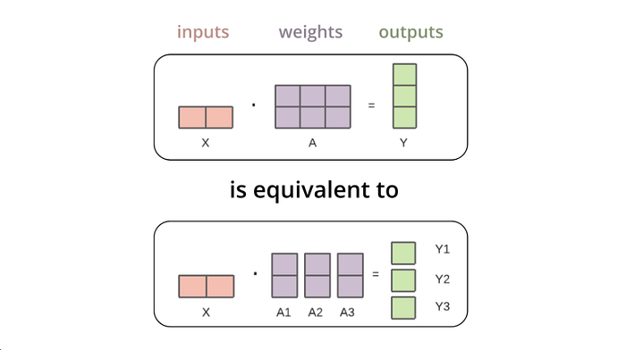
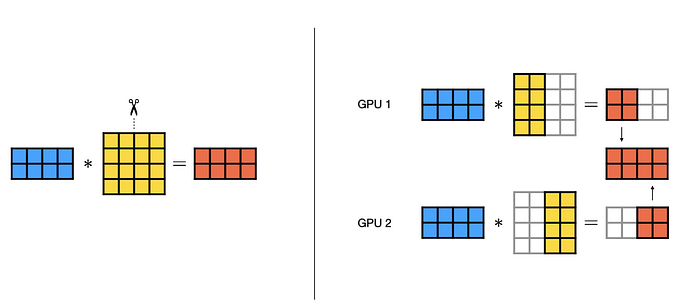
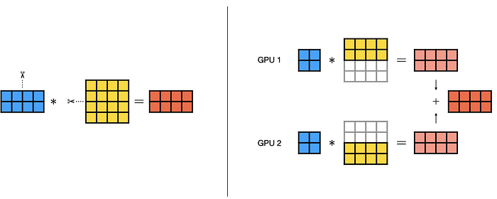
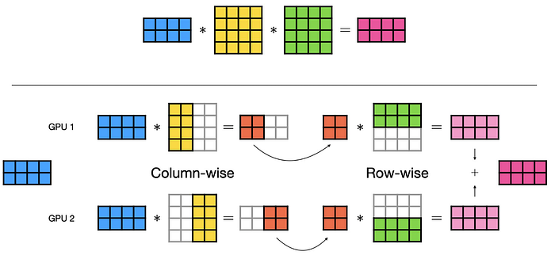

# LLM推理优化—张量并行（Tensor Parallelism）

## 引言

举个栗子： LLaMA 70B 在序列长度为 2,048 token 时，仅存储 attention cache 就需要大约 26GB。那就会引出一个关键问题：如果模型本体都放不进一张 GPU 显存该怎么办？毕竟，LLaMA 70B 全精度大约占用 140GB(BF16)，而多数消费级 GPU 只有 16–24GB 显存。

这正是模型分片引入的具体原因。这些技术让我们可以通过把超大模型切分到多个设备上来运行大模型。

## 成本与性能的挑战

现代语言模型规模呈指数级增长。GPT-3 有 175B 参数，需要约 350GB 内存；而像 Mixtral 8x7B 这样的模型，即便采用稀疏激活也需要约 90GB。如果没有成熟的分布式策略，这些模型将只属于拥有多 GPU 集群的组织。理解分片与 offloading，可以把这些强大模型带到更“平民化”的硬件配置上。

这些方法会直接影响推理的成本。设想一个生产场景：每秒服务 1,000 个请求。单请求时延 **50ms** 与 **100ms** 的差异，会直接转化为基础设施容量翻倍。通过优化模型分片策略和内存管理，我们可以在保持 LLM 服务质量的同时降低投入的成本。当与 KV Cache 结合时，高效分片就变得更关键了：糟糕的分布策略会在多个设备上重复缓存KVCache内存，而优化并行策略可以实现更高的性价比。

## 模型分片与策略

模型分片（Model Sharding）是指将模型参数分布到多个设备上。不是把完整 140GB 的 LLaMA 70B 放进单卡，而是拆到多张 GPU，每张卡持有一部分权重。分片主要有三类策略，分别适用于不同场景：

- Tensor Parallelism（张量并行）切分单层内部权重。
- Pipeline Parallelism（流水线并行）按模型层数切分，比如前N层一个节点后N层一个节点。
- Expert Parallelism（专家并行）分布专家子网络，常见于Deepseek等MOE模型中会使用。

### 张量并行（Tensor Parallelism）

张量并行是一种模型并行技术，它把单层内部的权重矩阵拆分到多张 GPU。



我们不再把完整权重矩阵放在一张卡上，而是切分后放到不同 GPU。每张 GPU：

1. 接收相同输入（或同步后的部分输入）
2. 处理自己那部分权重矩阵
3. 产生部分输出
4. 与其他 GPU 通信并合并结果

之所以叫“Tensor Parallelism”，是因为我们是在 **张量运算级别** 做并行，具体就是矩阵乘法。在深度学习框架里，权重矩阵以 tensor 形式存储，而我们把这些 tensor 分散到多设备。

考虑一个Linear标准线性层：

```python
Y = X @ W

Where:
- `X` is the input: shape `[batch_size, seq_len, hidden_size]`
- `W` is the weight matrix: shape `[hidden_size, output_size]`
- `Y` is the output: shape `[batch_size, seq_len, output_size]`

With Tensor Parallelism, we partition `W` into chunks:

W = [W₁ | W₂ | W₃ | W₄]

Each GPU computes:

Y₁ = X @ W₁
Y₂ = X @ W₂
Y₃ = X @ W₃
Y₄ = X @ W₄

Then we concatenate:
Y = [Y₁ | Y₂ | Y₃ | Y₄]
```

张量并行的核心在于：**矩阵乘法天然支持这种分解**。我们无需改算法，只需改变数据分布就可以。

### 4 张 GPU 的前馈层示例 — 张量并行

设想 Transformer 的一个前馈层：

- 输入维度：8,192（hidden dimension）
- 输出维度：32,768（4× 扩展，Transformer 常见）
- 权重矩阵 `W`：形状 `[8192, 32768]`
- 内存需求：FP16 下 **512 MB**

**不使用** 张量并行时，一张 GPU 必须持有全部 512 MB 并完成完整计算。

**使用** 张量并行（4 张 GPU）时，我们沿输出维度（列）切分权重矩阵：

- **GPU 0**：W₀ = [8192, 8192] — **128 MB**
- **GPU 1**：W₁ = [8192, 8192] — **128 MB**
- **GPU 2**：W₂ = [8192, 8192] — **128 MB**
- **GPU 3**：W₃ = [8192, 8192] — **128 MB**

这样每张卡只用 128 MB，而不是 512 MB，此层内存占用降低 4 倍。

为了拼接结果，GPU 之间必须交换输出。每张 GPU 产出的输出块形状为 [8 × 2048 × 8192]，FP16（每值 2 字节）下等于 **256 MB**（8 × 2048 × 8192 × 2 bytes = 256 MB）。

因为有 4 张 GPU，且每张都需要完整拼接结果，所以每张 GPU 需要发送自己的 256 MB，同时接收来自其他 3 张卡的 768 MB（3 × 256 MB），即每卡总计 **1 GB 通信量**。

这些数据交换通过 NVLink（600 GB/s）或 PCIe（32 GB/s）等高速互联完成，互联带宽会显著影响整体性能。

> 注意：即使每个权重分片只有 128 MB，输出大小却由 batch 维度（batch_size × seq_length × output_per_gpu）决定，这就是为什么要通信 256 MB 而不是 128 MB。

## **理解TP并行下的列并行与行并行**

### 列并行（Column Parallelism）

列并行把权重矩阵按列 **纵向** 切分到不同 GPU。若矩阵 W [M, N] 分布在 2 张卡上，每张卡各得一半列：W₀ [M, N/2] 与 W₁ [M, N/2]。每张卡拿到不同列、但完整行。



计算时，所有 GPU 接收同一输入 X，并独立计算各自部分：Y₀ = X @ W₀ 与 Y₁ = X @ W₁。然后把结果横向拼接得到完整输出：Y = [Y₀ | Y₁]。这需要一次 **All-Gather** 通信：每张 GPU 发送自己的结果并接收其他所有 GPU 的结果。

这种策略非常适合“扩维层”，例如前馈网络第一层投影，把 hidden_size（如 8,192）扩展到 4 × hidden_size（32,768）。部分输出的拼接天然对应扩展后的输出维度，因此它是扩展层（FFN）默认常用选择。

### 行并行（Row Parallelism）

行并行采用相反方式：按行横向切分矩阵。

每张 GPU 获得一块水平切片：W₀ [M/2, N] 与 W₁ [M/2, N]。每张卡拿到不同的行、但完整列。这个方案本质上不同，因为它还要求 **输入也要切分**。



计算时，每张 GPU 同时处理自己那部分权重和输入：Y₀ = X₀ @ W₀ 与 Y₁ = X₁ @ W₁。要得到最终输出，必须 **对部分结果求和**：Y = Y₀ + Y₁。这需要 **All-Reduce** 通信：GPU 交换输出并在设备间求和。这与列并行中的拼接通信不同。

这种策略在“降维层”中表现更好，例如前馈网络第二层投影，把 4 × hidden_size 压回 hidden_size。因为输出维度比输入小，部分结果相加比拼接更自然。它的关键优势是与列并行串联时可以消除冗余通信步骤。

### 组合两种策略

真正的性能优化出现在同一个前馈网络里把列并行与行并行串起来。扩维层（hidden -> 4×hidden）用列并行，降维层（4×hidden -> hidden）用行并行，可以消掉一次完整通信步骤。

列并行得到分片输出 [Y₀ | Y₁ | Y₂ | Y₃] 后，我们不立刻 gather 成完整 tensor，而是保持分片状态。因为后续行并行第二层本来就需要分片输入，于是可直接消费这批激活。直到最终计算后，才做一次 All-Reduce 合并结果。



与“两个层都用列并行”（第一层后 gather、第二层前再 scatter）相比，这个优化几乎把通信开销减半。NVIDIA Megatron-LM 等现代实现广泛采用该模式，它也是高效大模型训练与推理中的经典做法。

### **PP并行Pipeline Parallelism**

虽然张量并行非常擅长在单节点内把单层拆到多张 GPU，但它有扩展上限。超过 8–16 张 GPU 后，通信开销会明显上升，并且每层后都要全卡同步，也就是所有 GPU 都要等最慢的一张。这会引出一个关键问题：**如何扩展到几百甚至上千张 GPU？**

Pipeline Parallelism 给出了一种本质不同的思路：按层 **纵向切分模型**，而不是在层内横向切分。把一个 80 层的 LLaMA 70B 看成四工位流水线：GPU 0 处理 1–20 层，GPU 1 处理 21–40 层，GPU 2 处理 41–60 层，GPU 3 处理 61–80 层。数据像工厂流水线里的产品一样依次流过各工位。

后续我们将详细讲解 Pipeline Parallelism，理解如何用 GPipe、PipeDream 减少 pipeline bubble，并讨论何时将 Pipeline 与 Tensor Parallelism 结合以获得最优性能。

### **本文总结**

张量并行是一项基础技术，它通过在多张 GPU 上智能拆分权重矩阵，使超大语言模型得以运行。矩阵按列（column-parallel）或按行（row-parallel）切分后，每卡显存需求可以按 GPU 数量等比例下降。例如 140GB 的 LLaMA 70B，就可转化为 4 卡下每卡约 35GB 的可行部署。

张量并行的有效性高度依赖高速互联。NVLink 600 GB/s 下，通信开销通常可控在 10–15%；但若是 32 GB/s 的 PCIe，通信时间可能就会超过计算时间，使该技术收益转负。这也是为什么张量并行最适合单节点内 2–8 张紧耦合 GPU，而不是跨节点分布式场景（不想引入跨级通信)。
