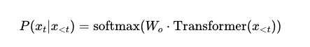
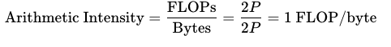
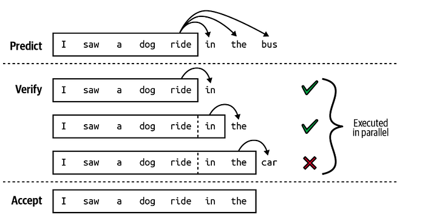
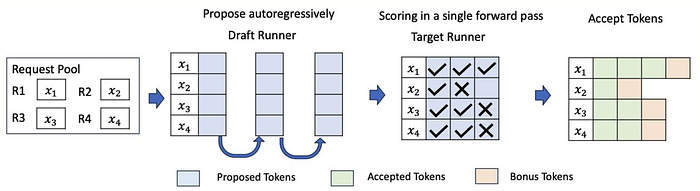

# LLM推理优化-投机解码代码实验：在不降低模型效果的前提下加速 LLM 推理

# **投机解码：在不降低模型效果的前提下加速 LLM 推理**

## **引言**

本文我们来看 **Speculative Decoding（投机解码）**：一种在保持与标准自回归解码数学上等价输出分布的同时，显著降低时延的推理优化方法。

我们可以利用一个更小、更快的模型先起草候选 token，再用目标模型并行验证，从而利用“顺序生成成本”与“并行验证成本”之间的不对称性。

## **问题：受内存限制的自回归生成**

基于 Transformer 的 LLM 以自回归方式生成文本，计算如下：



每一步解码都需要对模型执行一次完整前向传播来生成单个 token。对于长度为 *n* 的序列，这意味着需要 *n* 次串行前向传播。

### **内存带宽瓶颈**

单 batch 推理中的关键性能约束是 **内存带宽**，而不是算力。我们从算术强度来分析原因。

为了理解这一瓶颈，我们拆解一下：一个拥有 *P* 个参数的模型在生成单个 token 时发生了什么。

**内存访问**：每个参数以 FP16 格式存储，每个值占用 2 字节。因此加载全部权重大约需要从 GPU 内存（HBM）读取 *2P* 字节到计算单元。

**计算量**：在前向传播中，模型执行矩阵-向量乘。对每个权重，我们执行一次乘加操作（一次乘法加一次加法），总计约 *2P* 次浮点运算（FLOPs）。

**算术强度**：该指标衡量每传输 1 字节内存能换来多少计算。在这里：



换句话说，我们艰难地从内存搬来每一个字节数据，只能做一次浮点运算。GPU 强大的并行计算能力大部分时间处于空闲，等待数据到达。

再看现代硬件能力：

A100 GPU 约有 2 TB/s 内存带宽和 312 TFLOPS FP16 算力。要把这份算力吃满，算术强度大约需要 **156 FLOPs/byte**，而这比自回归解码能达到的水平高了 156 倍。

自回归解码的计算利用率通常低于 1%。GPU 绝大多数时间都在等待内存传输，而不是做有效计算。

虽然生成 token 是串行且受内存限制的，但验证一串 token 可以在一次前向传播中完成，额外成本很小。也就是说，同一次内存传输原本只生成 1 个 token，却可以同时产出多个位置的概率分布。

### **投机解码：核心架构**

投机解码使用两个模型协同工作。

- **草稿模型（Draft Model）** 是一个小而快的模型，通常在 1–7B 参数范围。它的职责是自回归生成 *K* 个候选 token。因为模型更小，它能非常快地产生草稿，但精度通常低于目标模型。
- **目标模型（Target Model）** 是我们最终要服务的大而准模型，通常 70B 参数或更大。它不是逐个生成 token，而是在一次前向传播中验证全部 *K* 个草稿候选，并同时计算每个位置的概率分布。

草稿模型必须显著快于目标模型（通常 1–10x），这样才能摊薄投机过程带来的额外开销。

> 在我们的测试中，将使用 7B 的目标模型和 0.5B 的草稿模型。这个规模的模型都能比较合理地放进一块 GPU。

### **算法概览**

该算法由三个简单阶段构成，并循环执行，直到生成完所有期望 token：

**阶段 1 Draft**：小模型快速生成 K 个候选 token（例如 K=5）。速度快，但可能出错，不被采纳。

**阶段 2 Verify**：大模型在一次前向传播里检查全部 K 个候选。这是关键的内容：验证这些K个候选token几乎和只生成 1 个 token 一样的开销。

**阶段 3 Accept/Reject**：比较概率。如果大模型认同某个草稿 token（或更有信心），就接受它；如果不认同，则拒绝该 token 及其后续 token，然后从大模型采样sample产出一个修正 token。

最佳情况是 K 个 token 全部被接受，再加上验证阶段的一个 bonus token。这意味着大约 1 次大模型前向传播的成本可得到 K+1 个 token。



草稿模型生成 K 个 token 序列，主模型接受它所认同的最长子序列。

核心思想很简单：当大模型“认同”时，我们希望接受草稿 token。

对于每个草稿 token，我们看两种概率：

- 草稿模型在选择该 token 时有多大把握？
- 目标模型对同一个 token 有多大把握？

如果目标模型同样有把握或更有把握 -> **总是接受**（100% 概率）

如果目标模型把握更低 -> 以降低后的概率接受（按“低了多少”来接受）

### **具体示例**

假设草稿模型以 60% 置信度生成 token “function”，而目标模型会给它 75% 置信度。因为 75% > 60%，说明目标模型认同，我们接受。

再看另一种情况：草稿模型以 40% 置信度生成 “variable”，但目标模型只给 8%。目标模型强烈不认同。

这时我们只以 8%/40% = 20% 的概率接受。大概率会拒绝，然后让目标模型挑一个更好的 token。

这种接受/拒绝机制在数学上被设计为：最终输出分布与仅使用目标模型时完全一致。这不是近似，而是精确等价。质量不变，只是更快。

这个技巧叫 **拒绝采样（rejection sampling）**，是统计学里的经典方法。

1. **当我们接受时**：我们按目标模型“认同程度”的比例来接受草稿 token。如果目标模型给该 token 的概率相同或更高，就总是接受；如果目标模型把握更低，就按两者置信度比例降低接受概率。
2. **当我们拒绝时**：我们不是简单丢弃 token 再重试，而是从一个特殊的“残差分布”中采样。该分布精确捕获了**目标模型会选但草稿模型漏掉**的部分。



可以把草稿模型分布想成较矮的柱状图，目标模型分布想成某些 token 上更高的柱状图。接受时，我们在“填充”两者重叠部分；拒绝并从残差采样时，我们在“填充”目标模型高于草稿模型的那部分。

把“来自草稿并被接受的 token”与“来自残差的修正 token”合并后，得到的分布可被严格证明与直接从目标模型采样一致。每个 token 出现概率都与完全不使用投机解码时相同。

这就是为什么投机解码是零质量折中。你不是在做近似、蒸馏或压缩。你得到的是完全相同的输出，只是通过了更快路径。

### **使用 Hugging Face 与 PyTorch 实现**

下面我们用 Transformers 库逐步实现投机解码。使用的是可直接运行的真实模型。

```
from transformers import AutoModelForCausalLM, AutoTokenizer
import torch
import time

draft_model_name = "Qwen/Qwen2.5-0.5B"  # 0.5B parameters
target_model_name = "Qwen/Qwen2.5-7B"   # 7B parameters

# Load tokenizer (same for both models)
tokenizer = AutoTokenizer.from_pretrained(target_model_name)

# Draft model
draft_model = AutoModelForCausalLM.from_pretrained(
    draft_model_name,
    torch_dtype=torch.float16,
    device_map="auto"
)

# Target model
target_model = AutoModelForCausalLM.from_pretrained(
    target_model_name,
    torch_dtype=torch.float16,
    device_map="auto"
)

print(f"Draft model: {sum(p.numel() for p in draft_model.parameters()):,} parameters")
print(f"Target model: {sum(p.numel() for p in target_model.parameters()):,} parameters")
print(f"Ratio: {sum(p.numel() for p in target_model.parameters()) / sum(p.numel() for p in draft_model.parameters()):.1f}x")

def draft_tokens(draft_model, input_ids, K=5, temperature=1.0):
    """
    Generate K draft tokens using the small model.
    """
    draft_ids = []
    draft_probs = []
    current_input = input_ids.clone()

    with torch.no_grad():
        for _ in range(K):
            outputs = draft_model(current_input)
            next_token_logits = outputs.logits[:, -1, :]

            probs = torch.softmax(next_token_logits / temperature, dim=-1)
            next_token = torch.multinomial(probs, num_samples=1)

            draft_ids.append(next_token)
            token_prob = probs.gather(-1, next_token)
            draft_probs.append(token_prob)

            current_input = torch.cat([current_input, next_token], dim=-1)

    # Return as 2D tensors [1, K]
    draft_ids = torch.cat(draft_ids, dim=-1)      # [1, K]
    draft_probs = torch.cat(draft_probs, dim=-1)  # [1, K]

    return draft_ids, draft_probs
```

目标模型在一次前向传播中验证所有草稿 token：

```
def verify_tokens(target_model, input_ids, draft_ids, temperature=1.0):
    """
    Verify all draft tokens in one forward pass.

    The key insight: we feed [input_ids + draft_ids] to the target model
    and get probability distributions for ALL positions at once.
    """

    # Ensure draft_ids is 2D
    if draft_ids.dim() == 1:
        draft_ids = draft_ids.unsqueeze(0)

    # Concatenate original input with draft tokens
    full_sequence = torch.cat([input_ids, draft_ids], dim=-1)

    with torch.no_grad():
        outputs = target_model(full_sequence)
        logits = outputs.logits

    # We need probabilities for positions where draft tokens were placed
    # If input_ids has length N and draft_ids has length K,
    # we want logits at positions N-1, N, N+1, ..., N+K-1
    # (position i predicts token i+1)

    K = draft_ids.shape[-1]
    start_pos = input_ids.shape[-1] - 1

    target_logits = logits[:, start_pos:start_pos + K + 1, :]
    target_probs = torch.softmax(target_logits / temperature, dim=-1)

    # Get probability distributions for each draft position + one extra
    return target_probs
```

现在我们实现带拒绝采样的 Accept/Reject：

```
def acceptance_sampling(draft_ids, draft_probs, target_probs, device):
    """
    Decide which draft tokens to accept using rejection sampling.

    This implements the core speculative decoding acceptance criterion:
    - Accept draft token with probability min(1, p(x)/q(x))
    - If rejected, sample from the residual distribution to correct bias
    - p(x) Probability of the target model for token x
    - q(x)Probability of the draft model for token x

    Args:
        draft_ids: Token IDs generated by draft model [1, K]
        draft_probs: Probabilities assigned by draft model [1, K]
        target_probs: Probabilities from target model [1, K+1, vocab_size]
        device: CUDA device for tensor operations

    Returns:
        accepted_ids: Tensor of accepted token IDs
        n_accepted: Number of tokens accepted (excluding bonus)
    """
    # Ensure correct shapes [1, K]
    if draft_ids.dim() == 1:
        draft_ids = draft_ids.unsqueeze(0)
    if draft_probs.dim() == 1:
        draft_probs = draft_probs.unsqueeze(0)

    K = draft_ids.shape[-1]  # Number of draft tokens
    accepted_ids = []

    # Iterate through each draft token sequentially
    for i in range(K):
        draft_token = draft_ids[:, i:i+1]  # [1, 1] - current draft token
        q_prob = draft_probs[:, i]          # [1] - draft model's probability q(x)

        # Target model's probability for this specific token: p(x)
        p_prob = target_probs[:, i, :].gather(-1, draft_token).squeeze(-1)  # [1]

        # Acceptance probability: min(1, p(x)/q(x))
        # This ensures we accept more often when target agrees with draft
        acceptance_ratio = (p_prob / (q_prob + 1e-10)).clamp(max=1.0)

        # Random acceptance decision using uniform random number
        if torch.rand(1, device=device).item() < acceptance_ratio.item():
            # Token accepted - add to our sequence
            accepted_ids.append(draft_token)
        else:
            # Token rejected - sample from residual distribution
            # The residual distribution corrects for the draft model's bias
            p_dist = target_probs[:, i, :]  # Target's full distribution
            q_dist = torch.zeros_like(p_dist)
            q_dist.scatter_(-1, draft_token, q_prob.unsqueeze(-1))

            # Residual distribution: max(0, p - q) normalized
            # This samples tokens that target prefers but draft underweighted
            residual = torch.clamp(p_dist - q_dist, min=0)
            residual_sum = residual.sum(dim=-1, keepdim=True)

            if residual_sum.item() > 1e-10:
                # Sample from normalized residual distribution
                residual = residual / residual_sum
                correction = torch.multinomial(residual, num_samples=1)
            else:
                # Fallback: sample directly from target distribution
                correction = torch.multinomial(p_dist, num_samples=1)

            accepted_ids.append(correction)
            break  # Stop here - all following draft tokens are now invalid

    n_accepted = len(accepted_ids)

    # Bonus token: if we accepted all K tokens, we get a free extra token
    # This is the key efficiency gain - we verified K tokens but get K+1
    if n_accepted == K:
        bonus_token = torch.multinomial(target_probs[:, K, :], num_samples=1)
        accepted_ids.append(bonus_token)

    # Concatenate all accepted tokens into single tensor
    if accepted_ids:
        accepted_ids = torch.cat(accepted_ids, dim=-1)  # [1, n]
    else:
        accepted_ids = torch.tensor([[]], dtype=torch.long, device=device)

    return accepted_ids, n_accepted
```

整合起来如下：

```
def speculative_generate(
    prompt: str,
    draft_model,
    target_model,
    tokenizer,
    max_new_tokens: int = 50,
    K: int = 5,
    temperature: float = 1.0
):
    """
    Generate text using speculative decoding.
    """
    device = next(draft_model.parameters()).device
    input_ids = tokenizer.encode(prompt, return_tensors="pt").to(device)
    generated = input_ids.clone()

    total_draft_tokens = 0
    total_accepted = 0
    total_generated = 0

    while total_generated < max_new_tokens:
        # Phase 1: Draft K tokens
        draft_ids, draft_probs = draft_tokens(
            draft_model, generated, K=K, temperature=temperature
        )
        total_draft_tokens += K

        # Phase 2: Verify with target model
        target_probs = verify_tokens(
            target_model, generated, draft_ids, temperature=temperature
        )

        # Phase 3: Accept/Reject
        accepted_ids, n_accepted = acceptance_sampling(
            draft_ids, draft_probs, target_probs, device
        )

        num_new = accepted_ids.shape[-1] if accepted_ids.numel() > 0 else 0
        total_accepted += num_new
        total_generated += num_new

        print(f"Drafted {K} tokens, accepted {n_accepted} (+bonus = {num_new}) tokens.")
        print(f"Total generated: {total_generated}/{max_new_tokens}")

        # Append accepted tokens
        if accepted_ids.numel() > 0:
            if accepted_ids.dim() == 1:
                accepted_ids = accepted_ids.unsqueeze(0)
            generated = torch.cat([generated, accepted_ids], dim=-1)

        # Check for EOS
        if tokenizer.eos_token_id is not None:
            if tokenizer.eos_token_id in accepted_ids:
                print("EOS token found!")
                break

    output_text = tokenizer.decode(generated[0], skip_special_tokens=True)
    acceptance_rate = total_accepted / total_draft_tokens if total_draft_tokens > 0 else 0

    return output_text, acceptance_rate
```

现在看看投机解码在实践中的表现。

下面的函数对比了标准自回归生成（只用目标模型）与投机解码（草稿模型 + 目标模型）。

这个对比会展示两项指标：**墙钟时间**（实际耗时）和 **接受率**（草稿 token 被接受的比例）。

较高的接受率（>70%）通常意味着显著加速。注意：尽管我们用了两个模型，但昂贵的大模型前向传播次数明显减少，而这正是时间主要消耗点。

```
def compare_generation_speed(prompt, max_new_tokens=50):
    """
    Compare standard generation vs speculative decoding.
    """
    print(f"Prompt: {prompt}\n")
    print("=" * 60)

    device = next(target_model.parameters()).device
    input_ids = tokenizer.encode(prompt, return_tensors="pt").to(device)

    # Warmup (important for CUDA)
    print("Warming up...")
    with torch.no_grad():
        _ = target_model(input_ids[:, :5] if input_ids.shape[1] > 5 else input_ids)
        _ = draft_model(input_ids[:, :5] if input_ids.shape[1] > 5 else input_ids)
    torch.cuda.synchronize()
    print("Warmup complete.\n")

    # Standard generation
    torch.cuda.synchronize()
    start = time.time()
    with torch.no_grad():
        standard_output = target_model.generate(
            input_ids,
            max_new_tokens=max_new_tokens,
            do_sample=True,
            temperature=1.0,
            pad_token_id=tokenizer.eos_token_id
        )
    torch.cuda.synchronize()
    standard_time = time.time() - start
    standard_text = tokenizer.decode(standard_output[0], skip_special_tokens=True)

    print(f"STANDARD DECODING (target model only)")
    print(f"Time: {standard_time:.2f}s")
    print(f"Tokens/sec: {max_new_tokens/standard_time:.1f}")
    print(f"Output: {standard_text[:200]}...")
    print()

    # Speculative decoding
    torch.cuda.synchronize()
    start = time.time()
    spec_text, acceptance_rate = speculative_generate(
        prompt, draft_model, target_model, tokenizer,
        max_new_tokens=max_new_tokens, K=5
    )
    torch.cuda.synchronize()
    spec_time = time.time() - start

    print(f"\nSPECULATIVE DECODING (draft + target)")
    print(f"Time: {spec_time:.2f}s")
    print(f"Tokens/sec: {max_new_tokens/spec_time:.1f}")
    print(f"Acceptance rate: {acceptance_rate:.1%}")
    print(f"Speedup: {standard_time/spec_time:.2f}x")
    print(f"Output: {spec_text[:200]}...")

# Run the comparison
compare_generation_speed(
    "The future of artificial intelligence will",
    max_new_tokens=20
)
```

结果如下：

```
Prompt: The future of artificial intelligence will

============================================================
Warming up...
Warmup complete.

STANDARD DECODING (target model only)
Time: 136.14s
Tokens/sec: 0.1
Output: The future of artificial intelligence will see robots and humans interacting in all areas of work and life. How the robots and machines will be...

SPECULATIVE DECODING (draft + target)
Time: 35.17s
Tokens/sec: 0.6
Acceptance rate: 84.0%
Speedup: 3.87x
Output: The future of artificial intelligence will determine whether humans will be replaced by computers that control everything, including human destiny.
The day that AI will...
```

投机解码相对标准自回归生成实现了 **3.87x 加速**，推理时间从 136.14 秒降至 35.17 秒。84.0% 的高接受率说明草稿模型与目标模型分布对齐较好，这在两者同属 Qwen2.5 家族、共享相近训练数据和架构时是符合预期的。

观测吞吐从 0.1 token/s 提升到 0.6 token/s。这一提升来自：目标模型一次前向可验证多个草稿 token，从而将计算成本在被接受 token 上摊薄。

> 需要说明的是，我们的实现没有使用 KV-cache，随着序列长度增加会引入二次复杂度。带有完善 KV-cache 管理的生产实现，尤其在更长生成任务中，通常能获得更高的加速比。

## 使用 Hugging Face 内置 Assisted Generation

Hugging Face Transformers 已通过 **Assisted Generation** 内置投机解码。用法如下：

```
from transformers import AutoModelForCausalLM, AutoTokenizer

# Load models (using the same tokenizer is required)
assistant_model = AutoModelForCausalLM.from_pretrained(
    "Qwen/Qwen2.5-0.5B",
    torch_dtype=torch.float16,
    device_map="auto"
)

main_model = AutoModelForCausalLM.from_pretrained(
    "Qwen/Qwen2.5-7B",
    torch_dtype=torch.float16,
    device_map="auto"
)

tokenizer = AutoTokenizer.from_pretrained("Qwen/Qwen2.5-7B")

# Generate with assisted decoding (speculative decoding)
prompt = "Machine learning is transforming"
inputs = tokenizer(prompt, return_tensors="pt").to(main_model.device)

# Standard generation
outputs_standard = main_model.generate(
    **inputs,
    max_new_tokens=100,
    do_sample=False  # Greedy for fair comparison
)

# Assisted generation (speculative decoding!)
outputs_assisted = main_model.generate(
    **inputs,
    max_new_tokens=100,
    assistant_model=assistant_model,
    do_sample=False
)

print("Standard:", tokenizer.decode(outputs_standard[0]))
print("Assisted:", tokenizer.decode(outputs_assisted[0]))
# Both outputs should be IDENTICAL — that's the guarantee!
```

## 什么会影响性能？

1. **同模型家族**：例如用 Llama-7B 给 Llama-70B 做草稿，通常远好于混用不同架构，因为它们在相似数据和目标上做的训练，所以相对通用一些。
2. **任务可预测性**：代码补全、翻译、结构化输出的接受率通常高于创作类写作或开放式聊天。
3. **更低温度**：采样更确定时，草稿模型与目标模型更可能一致。
4. **合适的 K 值**：太小（K=2）加速不足；太大（K=10）后段 token 常被拒绝。K=4–6 通常是甜点区间。

## 本文总结

投机解码代表了 LLM 推理优化中的一种范式转变：在保持数学上完全相同输出质量的前提下，实现 2–3x 的时延改进。

通过利用“顺序生成”和“并行验证”之间的不对称性，这项技术让小草稿模型可以“提议”多个 token 候选，再由大目标模型同时验证。

这种优雅的方法绕开了基础性的 **内存带宽瓶颈**，而且无需架构改造、量化，或传统优化方法常见的质量折中。

对于构建生产推理系统的 ML 工程师和数据科学家，投机解码在实时聊天、代码补全、交互助手等时延敏感场景具有很高价值。

它还能与其他优化自然组合，如 KV 缓存、张量并行与模型切分，形成一整套高效 LLM 部署工具链。

Hugging Face Transformers 等框架已经通过 assisted generation 提供原生支持，采用门槛很低，只需要同家族且兼容的草稿模型。

随着语言模型持续扩展，且 **推理成本仍是主要瓶颈**，投机解码这类技术将成为关键基础设施组件。

该方法在不牺牲输出质量的前提下实现加速，这使其对同时强调性能与可靠性的企业部署尤其有吸引力。无论是从零实现，还是直接利用框架能力，理解投机解码都能帮助实践者构建更快、更灵敏的 AI 应用。

## 参考文献

1. Leviathan, Y., Kalman, M., & Matias, Y. (2023). “Fast Inference from Transformers via Speculative Decoding.” **ICML 2023**.
2. Chen, C., et al. (2023). “Accelerating Large Language Model Decoding with Speculative Sampling.” **arXiv:2302.01318**.
3. Cai, T., et al. (2024). “Medusa: Simple LLM Inference Acceleration Framework with Multiple Decoding Heads.” **ICML 2024**.
4. Hugging Face Documentation: [Assisted Generation](https://huggingface.co/docs/transformers/generation_strategies#assisted-decoding)
5. [https://developer.nvidia.com/blog/an-introduction-to-speculative-decoding-for-reducing-latency-in-ai-inference/](https://developer.nvidia.com/blog/an-introduction-to-speculative-decoding-for-reducing-latency-in-ai-inference/)
6. [https://research.google/blog/looking-back-at-speculative-decoding/](https://research.google/blog/looking-back-at-speculative-decoding/)
7. Yunhai Hu., et al. (2025) “Speculative Decoding and Beyond: An In-Depth Survey of Techniques”
