# LLM推理优化核心技术

## KV Cache：基础中的基础

KV Cache 是 Transformer 注意力机制最自然的一类优化。随着自回归推理进入大规模生产，它几乎成为必需品。没有 KV Cache 的话，每生成一个新 token，都要从头对整个历史序列重算注意力，导致时延和成本都随序列长度呈平方级增长。

> 没有 KV Cache：每个新 token 都重算整段序列的注意力，成本约为 **O(n²)**，规模化时速度和成本都难以接受。
> 有 KV Cache：把每个 token 已算出的 K/V 张量缓存起来，每个新 token 的注意力计算降为 **O(n)**，这是生产推理的关键能力。

## Prefix Caching：跨请求复用 KV

KV Cache 不只是“让单次请求可用”。Prefix Caching 把复用能力扩展到了多个请求：只要它们共享同样的前缀，就能共享已计算过的 KV。 Vllm使用PrefixCaching, Sglang使用RadixTree

核心思想：举个例子，如果某次请求里出现过 “I want to travel to” 这段前缀，那么该前缀对应 KV 已经算好。下一次请求只要开头 token 一样，就可以直接跳过这段 prefill，复用已有 KV，从第一个新 token 开始算。这样能降低 TTFT，并节省算力。

### Prefix Caching 最有价值的场景

**复杂系统提示词**：应用里每次请求都带很长、稳定的 system prompt。**代码补全**：同一会话下，文件上下文往往高度一致。**文档问答与检索**：多轮对话里会反复出现相同检索片段。

> 这就是为什么按 token 计费的 API 往往对 **cache hit input tokens** 收费更低：这部分计算已经做过。

**上下文工程建议：**Prefix Caching 只对“从序列起点到第一个新 token”这一段生效。想提高命中率，应把变化内容尽量往后放：稳定的 system prompt 和文档放前面，用户个性化问题放后面。

### 非前缀缓存（研究热点）

Prefix Caching 的硬限制是：只能复用到第一个不重复 token 为止。当前研究在尝试缓存 prompt 中间任意位置的 token，但要解决位置编码修正问题以保证正确性。**CacheBlend** 和 **LMCache** 是当前支持非前缀缓存的代表性工具。

## KV Cache 存储：内存分层问题

KV Cache 理想上应尽量靠近算力侧，但 GPU VRAM 有限且很快会被占满。给 KV Cache 分多少显存，是推理系统中的核心配置项。

以 TensorRT-LLM 配置 `kv_cache_config.free_gpu_memory_fraction = 0.8` 为例：在一张 B200（180GB VRAM）上，若模型权重与 buffer 占用 100GB，剩余 80GB 中的 80%（即 64GB）可给 KV Cache。KV Cache 填满后必须淘汰旧条目，这会提高后续请求的 cache miss 风险。

> 这也是为什么生产环境通常会把 KV Cache 下沉到更慢的存储层：

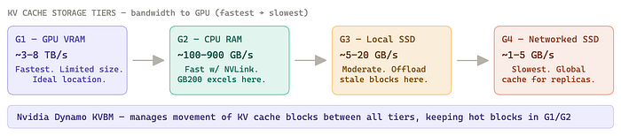

像 **GB200** 这类 SKU 会搭配专用 CPU 与高带宽互联，因此 G2 层速度会明显更快。

**Nvidia Dynamo** 通过 KV Block Manager（**KVBM**）支持 KV offloading，提供 API 在不同存储层之间移动 KV block，并把高频访问 block 保持在最高带宽层。

## Cache-Aware Routing（缓存感知路由）

生产里通常是多副本推理服务，通过负载均衡分发请求。但要吃满 Prefix Caching 红利，路由策略必须感知缓存状态。

**按用户粘性路由（Per-user sticky routing）**：同一用户请求始终打到同一副本。该用户会话历史的 KV Cache 会持续“热”在该副本上，响应更快、单轮成本更低。
**全局 KV Cache（G4）**：通过网络存储维护所有副本可访问的共享缓存。它比 VRAM 慢，但能保证任意副本都能复用任意预计算 KV，适合超大共享前缀（如系统提示词）。

## 处理长上下文

即使 KV Cache 已将注意力复杂度降到 O(n)，长上下文仍会在推理时大量吞噬 VRAM，而 decode 阶段又偏偏受显存带宽约束。

对应有三类关键算法优化：

**FlashAttention**
在片上 SRAM 中按小 tile 计算注意力，避免在 HBM 中显式构建完整 QKᵀ 矩阵，并融合 softmax 与缩放计算。它是**精确注意力**，不是近似，只是内存访问模式更优。

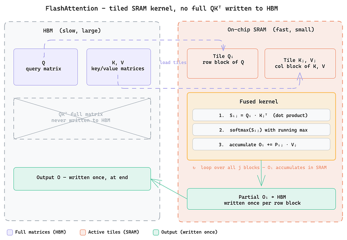

**PagedAttention**
把 KV 张量切成固定大小“页”，非连续存储并配查找表。可消除碎片、支持动态增长、支持跨请求共享，提升显存利用率与批处理灵活性。

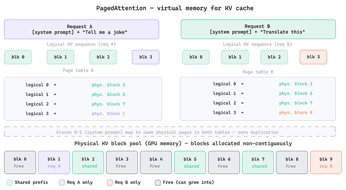

**Chunked Prefill**
把长提示词拆成块，增量构建 KV Cache。调度器可把某些请求的 chunked prefill 与其他请求的 decode 交错执行，平衡“算力密集”和“带宽密集”负载，是稳定高吞吐服务的重要基建能力。

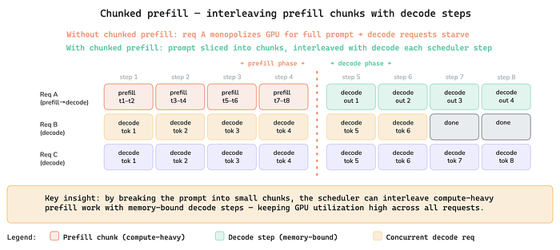

说明：RAG 或摘要本质上是**减少模型需要读取的数据量**；上面这些方法是当你决定把大量内容放进上下文窗口后，如何**更高效地存储并处理**这些数据。前者是架构策略，后者是算法/系统优化。

## 并行化（Parallelism）

前沿大模型无法装进单卡。FP8 下可粗略按“每十亿参数约 1GB”估算：DeepSeek V3 的 671B 参数约需 671GB，仅权重就远超 B200 的 180GB VRAM。即便 4 卡总量接近可容纳，也还要给 KV Cache 预留大量空间。很多场景下，整节点并行是必选项。

> **关键约束：**多 GPU 推理最大的瓶颈是 GPU 间通信开销。

NVLink 与 InfiniBand 带宽都远低于显存带宽。decode 又是显存带宽受限型任务，因此并行策略必须结合硬件拓扑设计，这就是 **topology-aware parallelism**。

## 三种并行方式

**Tensor Parallelism（TP）**：层内切分

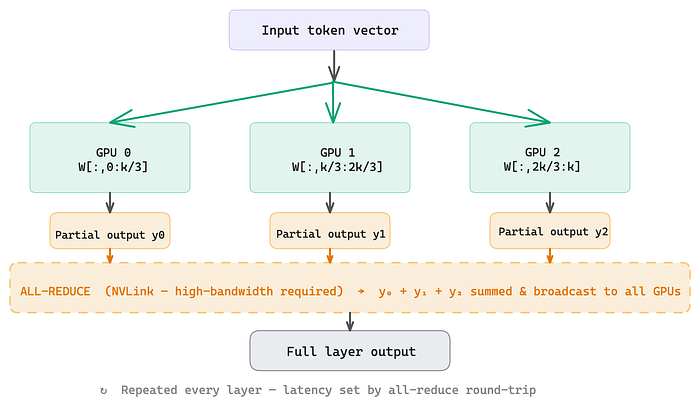

**Pipeline Parallelism（PP）**：按层段切分

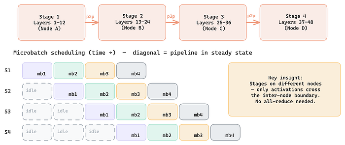

**Expert Parallelism（EP）**：MoE token 路由切分

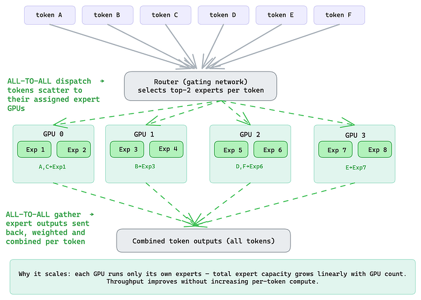

**三者对比：**

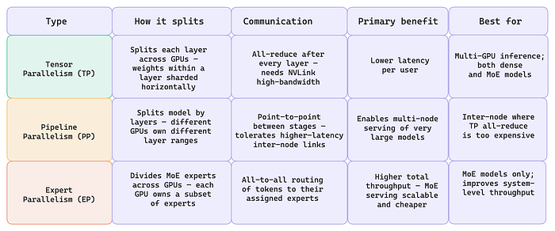

### TP + EP 混合部署

**稠密层 / 注意力层 -> Tensor Parallelism**
每个注意力层跨 GPU 切分，权重与矩阵乘分摊执行，并在下一层前通过 all-reduce 同步结果。它主要降低单用户时延，但依赖 NVLink 级别带宽。

**稀疏 MoE 层 -> Expert Parallelism**
每张 GPU 承载部分专家，token 被路由到对应专家所在 GPU。这里不需要 all-reduce，token 直接“去找专家”。它主要提升系统总吞吐，且避免 all-reduce 成为瓶颈。

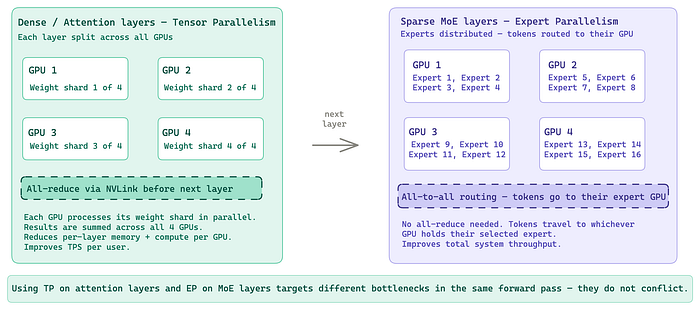

> 在稠密层使用 TP、在 MoE 层使用 EP 是互补关系：TP 针对计算重的注意力块降低时延，EP 则把专家路由负载高效分散到多卡，二者共同作用于同一次前向中的不同瓶颈。

## 多节点推理（Multi-node Inference）

当模型权重 + KV Cache 需求超过单节点（8 卡）容量时，就要扩展到多节点。多节点推理通常比多节点训练更复杂。

### 多节点挑战

- 节点间 InfiniBand 远慢于节点内 NVLink，因此 TP 的 all-reduce 跨节点会成为瓶颈。
- 多 GPU 云环境下的基础设施抽象与编排复杂度高。
- **Dense 模型**：通常节点内 TP，节点间 PP。
- **MoE 模型**：节点内 TP + 节点间 PP + EP 负责专家路由。TP8PP2 可降低单用户时延，叠加 EP 可提升整体输出吞吐。
- 若不是模型和 KV Cache 规模强制要求，多节点推理通常不是最优资源使用方式；横向副本扩展或解耦式服务往往更高效。

## 解耦（PD分离，Prefill Decode Disaggregation）

在这五类技术中，解耦是架构上最激进的一种。它基于三个关键观察：

- **Prefill 算力密集，Decode 显存带宽密集**。batch 变大后，两者会争夺同一批硬件资源。
- **专用化能提升性能**：从 kernel 选择到推理引擎调参，prefill 优化引擎与 decode 优化引擎各自都优于“一套引擎包办全部”。
- 高效并行化需要**尽量规避通信瓶颈**。拆开 prefill 与 decode 后，每个阶段可采用更匹配自身工作负载的并行策略。

### 工作机制

解耦架构把 prefill 与 decode 分到不同引擎，在不同 GPU 或节点上运行。

### 标准解耦流程

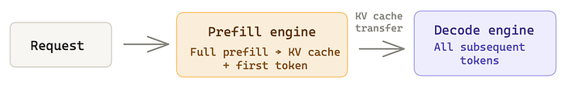

- **Prefill 引擎**接收输入序列，执行完整 prefill，计算 KV Cache，并生成首 token。
- 计算出的 KV Cache 通过硬件互联传给 decode 引擎（节点内 NVLink，节点间 InfiniBand）。
- **Decode 引擎**接收 KV Cache 后继续自回归生成后续 token。
- 两个引擎可分别扩缩容、分别调优、分别并行化。

### 条件聚合（Conditional Aggregation）：更实用的变体

全量解耦会让每个请求都承担额外开销。条件聚合更贴近真实流量。

**工作方式**

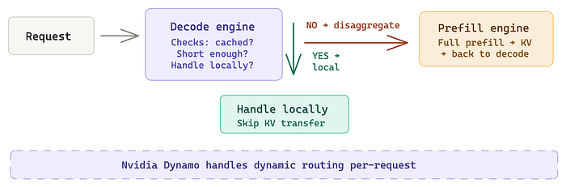

请求先到 **decode 引擎**，先判断：该序列是否已命中缓存？是否足够短可本地处理？如果是，就在 decode 引擎本地完成 prefill，跳过解耦路径；如果否，再转发到 prefill 引擎走解耦流程。

**为什么这样会更好呢？**

真实流量是混合分布，并非每个请求都值得走解耦。短请求或缓存命中请求可以完全绕过 KV 传输开销；只有长输入、未命中、prefill 计算重的请求才走解耦路径，此时额外开销才划算。

### 何时值得使用PD分离

解耦需要较高工程投入，一般仅在以下条件同时满足时才值得：

**条件1（规模）**：日服务量达到 1 亿到数十亿 token。低于这个量级，工程复杂度通常不划算。**条件2（模型）**：模型规模至少 100B 参数。更小模型单请求开销不够大，难以摊薄解耦成本。**条件3（流量画像）**：prefill 占比高，且输入序列长。若输入普遍较短，横向副本扩展通常更优。

> 如果条件 1 或 2 不成立，往往是“用更贵硬件换来很小收益”；如果条件 3 不成立，优先做横向扩展。

### Nvidia Dynamo 与动态解耦

**Nvidia Dynamo** 是一个整合多种推理优化技术的服务框架。针对解耦场景，Dynamo 支持动态聚合/解耦：根据实时条件（序列长度、缓存状态、引擎负载）在聚合路径与解耦路径之间自适应路由。它不是静态配置，而是按请求做决策，在需要时享受解耦收益，在不需要时避免无谓开销。

## 上述总结：Caching、Parallelism 与 Disaggregation

- KV Cache 把注意力计算从 O(n²) 降到 O(n)，没有它就没有大规模生产推理。
- Prefix Caching 把 KV 复用扩展到跨请求；稳定 token 放前、变化 token 放后可提升命中率。
- KV Cache 存储可看作四层层级：GPU VRAM -> CPU RAM -> 本地 SSD -> 网络 SSD；Nvidia Dynamo 的 KVBM 负责层间迁移。
- 缓存感知路由（按用户粘性或全局共享缓存）是多副本场景吃满 Prefix Caching 的关键。
- FlashAttention、PagedAttention、Chunked Prefill 是长上下文高效处理的基础算法。
- Tensor Parallelism 是默认多 GPU 低时延策略，强依赖 NVLink；多节点通常采用“节点内 TP + 节点间 PP”。
- Expert Parallelism 面向 MoE 模型，通过分布式专家路由提升系统总吞吐。
- 在稠密/注意力层用 TP，在 MoE 层用 EP，可同时命中不同瓶颈。
- Disaggregation 将 prefill 与 decode 分离，仅在超大规模（1e8+ token/day）、超大模型（100B+）与 prefill-heavy 流量下值得投入。
- Conditional Aggregation 是更实用形态：只让长且未命中的请求走解耦路径。
