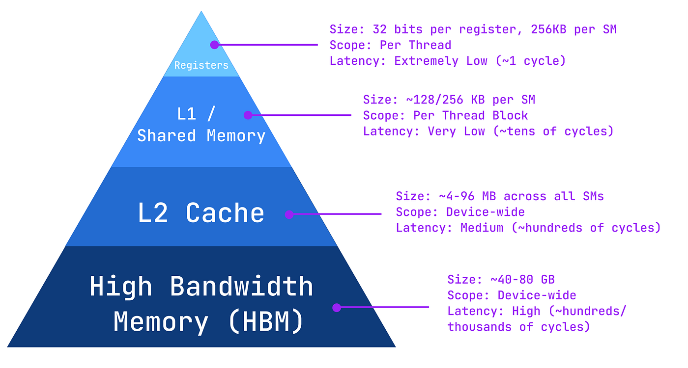
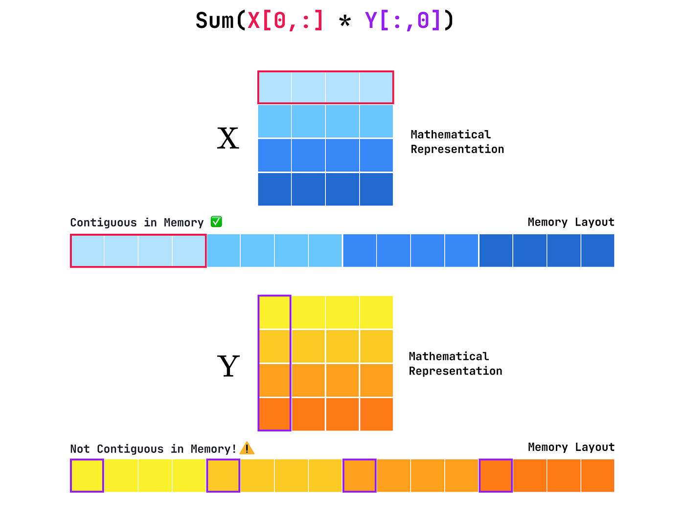
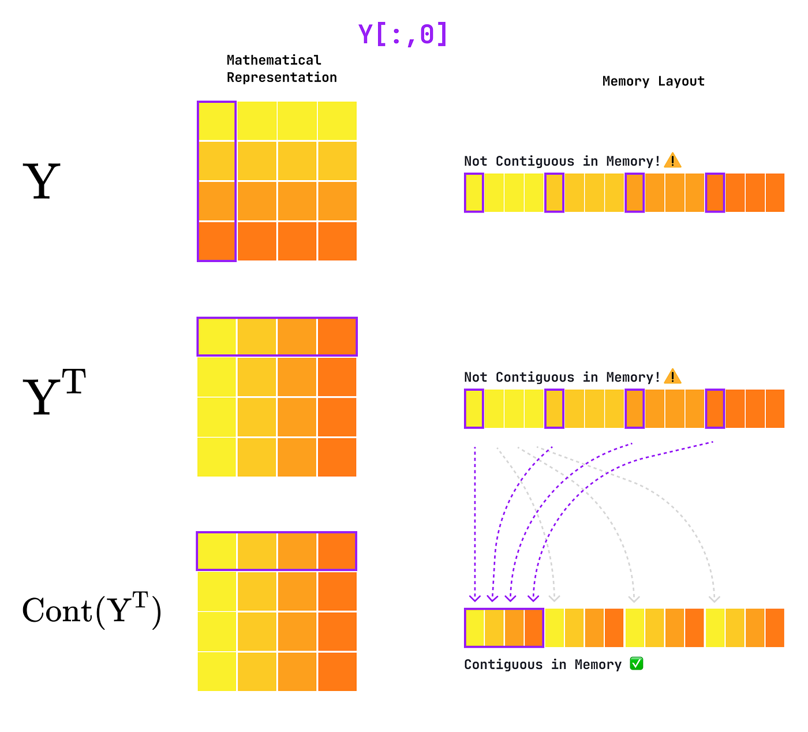

# Triton内核开发基础：矩阵乘法（GEMM）


矩阵乘法几乎是 GPU 上最常见的操作。它是线性代数的基础，广泛出现在图形学、物理仿真、科学计算和机器学习中。

本文会从概念层面拆解通用矩阵乘法（GEMM）实现，并引入两个核心优化概念：

- Tiling（分块）
- Memory Coalescing（内存合并访问）

最后落到 Triton 实现。

> 这是 Triton 系列第二篇。若你不熟悉 Triton 与 GPU 基础，建议先读上一篇向量加法。原作者完整代码：[https://github.com/RPegoud/Triton-Kernels](https://github.com/RPegoud/Triton-Kernels)


*本文目标：实现并理解并行分块 GEMM（Parallel Tiled GEMM）。*

## Naive GEMM（朴素实现）

我们要计算：

- `X` 形状 `(M, N)`
- `Y` 形状 `(N, K)`
- `Z = X @ Y`，形状 `(M, K)`

本质是 `X` 的每一行和 `Y` 的每一列做点积。

先看一个朴素 NumPy 版本：

```python
import numpy as np

M, N, K = 6192, 2048, 4096

X = np.random.randn(M, N)
Y = np.random.randn(N, K)
Z = np.zeros((M, K))

for i in range(M):
    for j in range(K):
        Z[i][j] = np.sum(X[i, :] * Y[:, j])
```

这个实现好理解，但访存效率很差。因为每处理 `X` 的一行，都要重复加载 `Y` 的所有列，导致大量冗余加载。


*朴素矩阵乘法：每一步的向量点积都在重复取数。*

可以把它类比成做菜时每用一个食材就跑一趟超市（全局内存），而不是一次搬到操作台（共享内存）反复使用。

优化就围绕两件事：

1. 如何减少冗余加载？
2. 一次加载多少数据最合适，放到哪层内存？

## Tiled GEMM（分块矩阵乘法）

分块思想是把大矩阵拆成小 tile（子矩阵），每次算一个输出子块，而不是一个标量。

例如：

- `X: (4, 6)`
- `Y: (6, 4)`
- `Z: (4, 4)`

你可以把点积分段累加，也可以二维扩展，一次计算 `Z` 的 `(2,2)` 子块并在共享维上累加。


*分块后，同一批加载数据可复用多次。*

对 `(2,2)` 分块来说，同一行/列会参与多个点积，等价于“每次加载做更多计算”。块越大，理论加载次数越少，但会受寄存器和共享内存容量约束。

## GPU 内存层级（A100 视角）

典型层级如下：

- **Registers**：最快最小，线程私有。
- **L1/Shared Memory**：每个 SM 的片上 SRAM，可配置。
- **L2 Cache**：全 SM 共享缓存，容量更大。
- **HBM**：容量最大，延迟也最高。



*越靠上越快越小，越靠下越慢越大。*

因此优化目标是：

- 少访问 HBM
- 多在片上复用数据

`BLOCK_SIZE = 64` 是常见起点，因为是 warp size（32）的倍数，通常有较好并行利用率。

## Parallel Tiled GEMM（并行分块）

在分块基础上，进一步把不同 tile 的计算分发给多个线程块并行执行。


*把“迭代 tile”改成“并行 tile”。*

## Memory Coalescing（内存合并访问）

合并访问指：同一 warp 中相邻线程访问相邻地址，以更高效地利用全局内存带宽。

而 PyTorch 默认是 **row-major**：

- 行内元素连续
- 列访问通常跨步



GEMM 需要访问 `Y` 的列，所以常见做法是：

1. `Y.T`
2. `Y.T.contiguous()`

注意仅 `Y.T` 只会改 stride 视图，不会改内存布局；`contiguous()` 才会按新布局重排。

在 kernel 内部再把 block 逻辑上转回：`z_block = tl.dot(X_block, Y_block.T)`。



*`Y`、`Y.T`、`Y.T.contiguous()` 在内存语义上的区别。*

## Triton 实现

先看包装函数（不做 `Y` 合并读取优化版）：

```python
import torch
import triton
import triton.language as tl

def block_matmul(X: torch.Tensor, Y: torch.Tensor) -> torch.Tensor:
    M, N = X.shape
    _, K = Y.shape

    Z = torch.empty((M, K), device="cuda")

    x_stride_m, x_stride_n = X.stride()
    y_stride_n, y_stride_k = Y.stride()
    z_stride_m, z_stride_k = Z.stride()

    BLOCK_SIZE = 64
    NUM_BLOCKS_M = triton.cdiv(M, BLOCK_SIZE)
    NUM_BLOCKS_K = triton.cdiv(K, BLOCK_SIZE)
    grid = (NUM_BLOCKS_M, NUM_BLOCKS_K)

    block_matmul_kernel[grid](
        X, x_stride_m, x_stride_n,
        Y, y_stride_n, y_stride_k,
        Z, z_stride_m, z_stride_k,
        M, N, K,
        BLOCK_SIZE,
    )

    return Z
```

核心 kernel：

```python
@triton.jit
def block_matmul_kernel(
        X_ptr, X_m_stride, X_n_stride,
        Y_ptr, Y_n_stride, Y_k_stride,
        Z_ptr, Z_m_stride, Z_k_stride,
        M, N, K,
        BLOCK_SIZE: tl.constexpr,
    ):
    # --- Ensure pointers are cast to float32 ---
    X_ptr = X_ptr.to(tl.pointer_type(tl.float32))
    Y_ptr = Y_ptr.to(tl.pointer_type(tl.float32))
    Z_ptr = Z_ptr.to(tl.pointer_type(tl.float32))

    # --- Get Program IDs ---
    m_idx = tl.program_id(axis=0)
    k_idx = tl.program_id(axis=1)

    # --- Block pointers ---
    x_block_ptr = tl.make_block_ptr(
        base=X_ptr,
        shape=(M, N),
        strides=(X_m_stride, X_n_stride),
        offsets=(m_idx * BLOCK_SIZE, 0),
        block_shape=(BLOCK_SIZE, BLOCK_SIZE),
        order=(0, 1),
    )
    y_block_ptr = tl.make_block_ptr(
        base=Y_ptr,
        shape=(N, K),
        strides=(Y_n_stride, Y_k_stride),
        offsets=(0, k_idx * BLOCK_SIZE),
        block_shape=(BLOCK_SIZE, BLOCK_SIZE),
        order=(0, 1),
    )
    z_block_ptr = tl.make_block_ptr(
        base=Z_ptr,
        shape=(M, K),
        strides=(Z_m_stride, Z_k_stride),
        offsets=(m_idx * BLOCK_SIZE, k_idx * BLOCK_SIZE),
        block_shape=(BLOCK_SIZE, BLOCK_SIZE),
        order=(0, 1),
    )

    # --- Tiled GEMM loop ---
    z_acc = tl.zeros((BLOCK_SIZE, BLOCK_SIZE), dtype=tl.float32)
    for _ in range(0, N, BLOCK_SIZE):
        x = tl.load(x_block_ptr, boundary_check=(0, 1), padding_option="zero")
        y = tl.load(y_block_ptr, boundary_check=(0, 1), padding_option="zero")
        z_acc += tl.dot(x, y)

        x_block_ptr = x_block_ptr.advance((0, BLOCK_SIZE))
        y_block_ptr = y_block_ptr.advance((BLOCK_SIZE, 0))

    tl.store(pointer=z_block_ptr, value=z_acc, boundary_check=(0, 1))
```

这里使用 block pointer 时，越界处理是 `boundary_check` + `padding_option`，而不是 `mask/other`。

Benchmark 代码如下：

```python
def bench(fn: callable, x: torch.Tensor, y: torch.Tensor, repeat: int):
  flops = []
  med_latency = []

  for _ in tqdm(range(repeat), desc=f"Benchmarking {fn.__name__}"):
    latency_ms = triton.testing.do_bench(
      lambda: fn(x, y),
      quantiles=[0.5], # get the median latency
      return_mode="all",
      )
    n_flops = 2 * M * N * K # matmul roughly requires 2*M*N*K operations
    tflops = n_flops / (latency_ms / 1e3) / 1e12

    med_latency.append(latency_ms)
    flops.append(tflops)

  flops = np.array(flops)
  med_latency = np.array(med_latency)
  print(f"Absolute Error: {torch.sum(torch.abs(X@Y - fn(x, y)))}")
  print(f"Median Latency: {med_latency.mean():.4f} ± {med_latency.std():.3f} ms")
  print(f"Throughput: {flops.mean():.4f} ± {flops.std():.3f} TeraFLOPS")

M = 8192
N = 6144
K = 4096

X = torch.randn((M, N), device="cuda", dtype=torch.float32)
Y = torch.randn((N, K), device="cuda", dtype=torch.float32)

bench(block_matmul, X, Y, repeat=10)
```

在 Colab T4 上的结果：

```text
Absolute Error: 0.0 # the kernel outputs the correct result!
Median Latency: 130.7831 ± 1.794 ms
Throughput: 3.1533 ± 0.043 TeraFLOPS
```

## 对 `Y` 做合并访问后的版本

原文接着给出 coalesced 版本，关键改动：

- `Y = Y.T.contiguous()`
- `y_block_ptr` 的 `shape/strides/offsets` 按 `Y.T` 视角定义
- 迭代时沿 `Y.T` 的列推进
- 点积时使用 `tl.dot(x, y.T)`

```python
@triton.jit
def coalesced_block_matmul_kernel(
    X_ptr, X_m_stride, X_n_stride,
    Y_ptr, Y_k_stride, Y_n_stride,
    Z_ptr, Z_m_stride, Z_k_stride,
    M, N, K,
    BLOCK_SIZE: tl.constexpr,
):
    ...
    y_block_ptr = tl.make_block_ptr(
        base=Y_ptr,
        # flip the shape, strides and offsets to match Y.T
        shape=(K, N),
        strides=(Y_k_stride, Y_n_stride),
        offsets=(k_idx * BLOCK_SIZE, 0),
        block_shape=(BLOCK_SIZE, BLOCK_SIZE),
        order=(0, 1),
    )
    ...

    for _ in range(0, N, BLOCK_SIZE):
        ... # loads
        z_acc += tl.dot(x, y.T)  # transpose Y back for dot product
        x_block_ptr = tl.advance(x_block_ptr, offsets=(0, BLOCK_SIZE))
        # advance the block pointer along columns of Y.T (i.e rows of Y)
        y_block_ptr = tl.advance(y_block_ptr, offsets=(0, BLOCK_SIZE))

    tl.store(pointer=z_block_ptr, value=z_acc, boundary_check=(0, 1))

def coalesced_block_matmul(X, Y):
    Y = Y.T.contiguous()  # Y is now (K,N)
    M, N = X.shape
    K, _ = Y.shape
    Z = torch.empty((M, K), device="cuda")

    x_stride_m, x_stride_n = X.stride()
    y_stride_k, y_stride_n = Y.stride()
    z_stride_m, z_stride_k = Z.stride()

    ...  # define BLOCK_SIZE and grid

    coalesced_block_matmul_kernel[grid](
        X, x_stride_m, x_stride_n,
        Y, y_stride_k, y_stride_n,
        Z, z_stride_m, z_stride_k,
        M, N, K,
        BLOCK_SIZE,
    )

    return Z
```

这个版本 benchmark 结果：

```text
Absolute Error: 0.0 # Again, the kernel is correct!
Median Latency: 261.9420 ± 0.858 ms
Throughput: 1.5741 ± 0.005 TeraFLOPS
```

吞吐反而变成了前一个版本的一半左右。

## 为什么“看起来更优”的版本更慢？

作者用 Nsight 检查后发现：

- kernel 内部转置造成了 bank conflict
- warp 大量等待，调度器经常没有可发射 warp
- 整体变成 latency-bound

慢版本指标：

```text
----------------------- ----------- --------------
Metric Name             Metric Unit   Metric Value
----------------------- ----------- --------------
...
DRAM Throughput                   %           8.20
Compute (SM) Throughput           %          21.14
...
```

对比更快版本：

```text
----------------------- ----------- --------------
Metric Name             Metric Unit   Metric Value
----------------------- ----------- --------------
...
DRAM Throughput                   %          29.35
Compute (SM) Throughput           %          74.39
...
```

说明优化不能只看直觉，必须看 profiling 数据。

## 总结

这次实验给出的核心结论：

- 看似合理的优化（如访存合并）可能引入新的瓶颈。
- 性能优化必须以 profiler 证据为准，而不是“理论上应该更快”。
- 更简单的 kernel 在某些硬件/负载下，反而更匹配真实执行路径。

后续可继续做：

1. 引入 autotune（自动搜索 `BLOCK_SIZE`、`num_warps`、`num_stages`）
2. 用 Nsight Compute 系统分析 bank conflict、occupancy、SM 利用率

## 参考资源

- 完整实现：[https://github.com/RPegoud/Triton-Kernels](https://github.com/RPegoud/Triton-Kernels)
- GEMM 入门与练习：[https://www.cs.sfu.ca/~ashriram/Courses/CS7ARCH/hw/hw4.html](https://www.cs.sfu.ca/~ashriram/Courses/CS7ARCH/hw/hw4.html)
- Nvidia Ampere 架构（A100）：[https://en.wikipedia.org/wiki/Ampere_(microarchitecture)#cite_note-15](https://en.wikipedia.org/wiki/Ampere_(microarchitecture)#cite_note-15)
