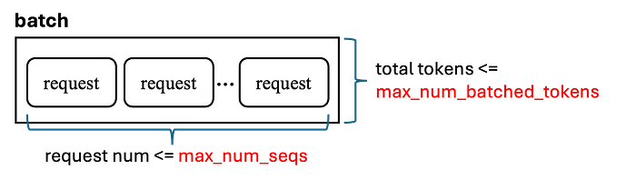
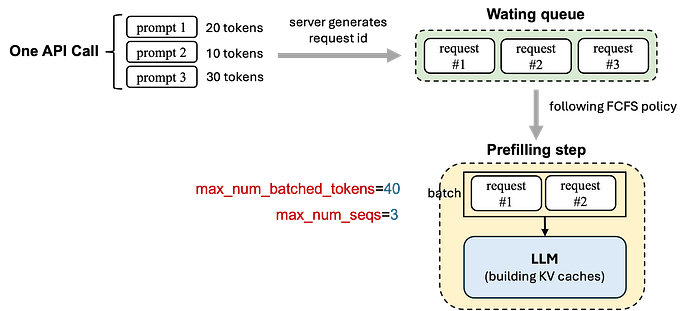

# LLM推理优化-vLLM 调度

# 如何理解 vLLM 调度逻辑

本文主要是为了介绍 **vLLM 调度器（scheduler）** 的设计，解释与调度相关的限制是如何影响推理吞吐的。具体聚焦三个重要概念：

- 推理 batch size 的限制
- chunked prefill
- scheduling policy

我们先看一个 vLLM 离线推理的典型使用示例：

```python
from vllm import LLM, SamplingParams

prompts = [
  "Write a one-sentence explanation of gravity:",
  "What is the capital of Japan?",
  "Complete this: The best way to learn Python is",
]

sampling_params = SamplingParams(
  temperature=0.7,
  top_p=0.95,
  max_tokens=64,
)

# Create the vLLM engine
llm = LLM(
  model="xxxxx",
  tensor_parallel_size=1,
  dtype="bfloat16",
  gpu_memory_utilization=0.85,
  max_model_len=4096,
)

# Run generation
outputs = llm.generate(prompts, sampling_params)
```

在这个示例里，三个 prompt 通过一次 API 调用传给 `llm.generate(...)`。其中一些配置字段比较直观：例如 `dtype` 控制模型数值精度，`gpu_memory_utilization` 控制 vLLM 为 KV cache 使用 GPU 显存的程度，`max_model_len` 设定了单请求允许的最大长度（包含 prompt token 与生成 token）,它会影响单次请求的KV Cache大小。

不过，**一次 API 调用并不意味着所有请求一定会在同一个推理 batch 中一次性执行**。例如你在一次调用里发送 100 个请求，vLLM 并不会简单地强行把 100 个请求塞进一个 GPU batch。实际执行由 **scheduler** 决定，它会决定每个 **scheduler step** 里运行哪些请求，以及当下可接纳多少 token 和 sequence。在实践中，吞吐受限因素通常不是 API 调用里有多少请求，而是 scheduler 的 token 与 sequence 有多少预算。在 [vLLM engine 文档](https://docs.vllm.ai/en/stable/configuration/engine_args/#schedulerconfig) 中，有几个关键参数用于配置推理 token 上限与 sequence 上限（单次推理 batch 的请求数）这两个吞吐瓶颈。

## 请求的调度周期

我们先从一个简化的 V0 风格示意来理解 scheduler 如何工作。


请求调度周期的简化示意图

从图片中看，当 prompt 到达时，vLLM 会创建 request 对象、分配 id，并放入 waiting queue。然后引擎重复执行 `step()`。请求先在 **waiting queue** 里等待，被 scheduler 接纳后移动到 **running queue**。为便于理解，我们可以把 vLLM 看成不断执行 scheduler 迭代。每次迭代里，scheduler 都在 token 与 sequence 限制约束下决定让哪些请求在下一步继续推进。

scheduler 在两类工作之间分配计算：

1. **Prefill**：处理 prompt token，并构建 KV cache。
2. **Decode**：基于已有 KV cache 生成新的输出 token。

*P.S. 这里我们采用 vLLM 老的V0 引擎调度来描述，即每次迭代要么是 prefill 要么是 decode。这样更便于建立直觉，尽管更新的 V1 引擎可以在同一步里混合 decode 与 prefill。*

如上图所示，scheduler 首先从 **waiting queue** 选择请求，主要遵循 **First Come, First Served (FCFS)** 顺序（按到达时间），并尽可能多地把请求纳入当前 batch。这些请求随后进入 **prefill**，vLLM 会处理其 prompt token 并构建 KV cache。之后它们留在 **running queue** 中，在后续 **decode** 迭代中持续推进，模型逐步生成 token，直到每个请求完成。

所以调度生命周期大致是：

1. 新请求进入 **waiting queue**。
2. 一旦被调度做 prefill，就移动到 **running queue**。
3. 在后续步骤中，它通常被当作 **decode request**，直到生成完成。

单次 scheduler 迭代能包含多少请求，由两个关键参数约束：`max_num_batched_tokens` 与 `max_num_seqs` 来决定。下一节解释这两个参数是如何工作的。

### *max_num_batched_tokens 与 max_num_seqs*

这两个参数共同决定单次 scheduler 迭代可包含的工作量。



max_num_batched_tokens 与 max_num_seqs

`max_num_seqs` 设定单次 scheduler 迭代（一个推理 batch）最多可包含的请求（或序列）数量；`max_num_batched_tokens` 设定该 batch 内所有请求 token 总数上限。

考虑上图示例：`max_num_seqs = 3`，`max_num_batched_tokens = 40`。假设有三个请求按 FCFS 顺序到达，其 prompt 长度分别是 20、10、30 token。

scheduler 先考虑请求 #1。加入后，batch 为：

- token 总数 = 20
- sequence 总数 = 1

两者都在限制内，因此请求 #1 可被接纳。

接着 scheduler 考虑请求 #2。加入后，batch 为：

- token 总数 = 30
- sequence 总数 = 2

仍都在限制内，因此请求 #2 也可被接纳。

然后 scheduler 考虑请求 #3。若把它也加入，batch 将变成：

- token 总数 = 60
- sequence 总数 = 3

**尽管 sequence 数仍满足 `max_num_seqs`，但 token 总数会超过 `max_num_batched_tokens`。因此请求 #3 不能在本轮加入，只能等待下一轮。**




从上面的图可以看到在一次迭代内就可以形成推理 batch

总体来说，提高 `max_num_seqs` 与 `max_num_batched_tokens`，可以让 scheduler 在每轮迭代打包更多的请求，进而可能提升吞吐。但更大的值也会增加 GPU 显存压力（所需要的KVCache也会更大)。

### 处理剩余请求


随着 **running queue** 中部分请求完成，它们占用的 KV cache 显存会被释放。这样 scheduler 在后续迭代中就有空间从 **waiting queue** 接纳更多请求。在这个简化视角里，这些新接纳请求随后进入 **prefill** 构建 KV cache，再进入 **running queue**，并在后续 **decode** 步骤持续推进直到完成。

> 这种设计使 **continuous batching** 成为可能：每个 step 之后，vLLM 既可以继续处理已经在进行中的请求，也可以考虑新到请求。通过不断释放已完成请求的空间，再用 waiting queue 中新请求填补该空间，vLLM 逐步处理完所有请求。

## Chunked Prefill

在更新的 V1 引擎中，引入了许多高级实现来优化模型推理。除了允许单次 scheduler 迭代同时包含 prefill 与 decode 之外，另一个重要实现是 [**chunked prefill**](https://docs.vllm.ai/en/stable/configuration/engine_args/#-enable-chunked-prefill-no-enable-chunked-prefill)（防止请求过大阻塞Decode)。

### 什么是 Chunked Prefill？

Chunked prefill 是针对长 prompt 的一种优化。它不在一次 prefill step 里处理完整 prompt，而是把 prompt 切成更小块，在多个 scheduler 迭代中处理。这样可避免单个超长请求一次性占用过多 token ，也能让 scheduler 更平滑地服务其他请求。

### 示例

继续看上面的例子。若开启 **chunked prefill**，当 scheduler 已接纳请求 #1 和 #2 后，当前 batch 里仍有 **10 个 token 槽位**。这时不用把请求 #3 完整留到下一轮，scheduler 可以把它的 prefill 切成更小块，并在当前轮先处理其中一部分。

在这个场景里，请求 #3 可拆成两块：一块 **10 token**，另一块 **20 token**。于是当前 batch 变为：

- 请求 #1：prefill 完整 **20** token
- 请求 #2：prefill 完整 **10** token
- 请求 #3：只 prefill 前 **10** token

这样刚好填满预算：

- sequence 总数 = **3**
- token 总数 = **20 + 10 + 10 = 40**


开启 chunked prefill 后的迭代

每个 prefill chunk 都在独立 scheduler step 中处理。在这些 step 里，vLLM 会持续为同一个请求追加 KV-cache block。最终一个 chunk prefill 完成后，该请求不再被视为部分 prefill 请求，而会成为正常的运行中 decode 请求，其完整 prompt 状态已经累积在 KV cache 中。

> 原则上，chunked prefill 不应改变该请求最终的 prompt KV-cache 内容；它主要改变的是 KV cache 在多个 scheduler step 中“增量构建”的方式。

## 调度策略（Scheduling policy）

scheduler 中的 [**scheduling policy**](https://docs.vllm.ai/en/stable/configuration/engine_args/#-scheduling-policy) 会影响 scheduler 在为下一步选择工作时如何排序候选队列中的请求。在实践中，这一点在“从 **waiting requests** 中选择待处理的对象”时最关键。vLLM 主要支持两种选择：`fcfs` 与 `priority`。

### FCFS **调度**

在 **FCFS** 下，scheduler 按请求到达顺序处理，行为简单且可预测。`fcfs` 是默认策略。

下面是服务模型时显式设置 **fcfs 调度** 的示例：

```python
llm = LLM(
    model="xxxx",
    tensor_parallel_size=1,
    dtype="bfloat16",
    gpu_memory_utilization=0.85,
    max_model_len=4096,
    scheduling_policy="fcfs",
)
```

### Priority 调度

Priority 调度按请求的 **priority 值** 排序，而不只看到达时间。数值越小优先级越高。若两个请求优先级相同，则用到达时间打破平局。在 priority 调度下，priority 值在提交请求时按请求传入。

下面是设置 **priority 调度** 的示例（[官方代码](https://docs.vllm.ai/en/v0.10.2/api/vllm/engine/async_llm_engine.html#vllm.engine.async_llm_engine._AsyncLLMEngine.add_request_async)）：

```python
import asyncio
from vllm import SamplingParams
from vllm.engine.arg_utils import AsyncEngineArgs
from vllm.engine.async_llm_engine import AsyncLLMEngine

async def run_request(engine, prompt, request_id, priority):
    final_output = None
    async for output in engine.generate(
        prompt=prompt,
        sampling_params=SamplingParams(temperature=0.7, top_p=0.95, max_tokens=64),
        request_id=request_id,
        priority=priority,
    ):
        final_output = output
    return final_output.outputs[0].text

async def main():
    engine = AsyncLLMEngine.from_engine_args(
        AsyncEngineArgs(
            model="meta-llama/Llama-3.2-1B-Instruct",
            scheduling_policy="priority",
        )
    )

    out1, out2 = await asyncio.gather(
        run_request(engine, "Write a one-sentence explanation of gravity:", "req-1", 0),
        run_request(engine, "What is the capital of Japan?", "req-2", 5),
    )

    print("req-1:", out1)
    print("req-2:", out2)

asyncio.run(main())
```

需要注意的是，本文有意剔除掉了一些底层系统细节只是为了简单讲清楚一些逻辑，让用户能够简单易懂，尤其是去除了 GPU 显存管理，而这些细节也会影响调度决策。这些细节在真实部署中相当重要，但不作为本文重点考虑方向，本文重点是帮助建立对 scheduler 核心逻辑的理解。

## 参考文献

1. [Inside vLLM: Anatomy of a High-Throughput LLM Inference System](https://blog.vllm.ai/2025/09/05/anatomy-of-vllm.html)
2. [Optimization and Tuning](https://docs.vllm.ai/en/v0.8.5/performance/optimization.html)
