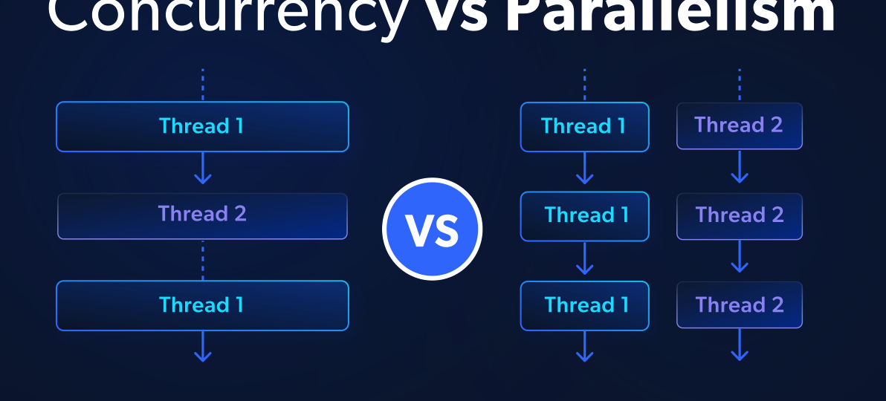

之前都是在vllm或者sglang引擎关注推理代码,主要还是以python代码为主，比较少的去了解cuda的一些基本概念，只知道推理速度快不清楚为什么快，如果期望更好的理解模型推理的并行机制，还是需要了解一些cuda下面的一些内容 接下来准备以CUDA基本概念，核心概念，案例来解释一下CUDA的一些知识。

# 一 基础理解：SM、Warp、Block、Thread的关系

首先我们先了解一下我们的卡的一些基本信息情况：我这里用H20做个例子：

+ **`<font style="color:#DF2A3F;">`H20卡上有多少个SM`</font>`**
+ **`<font style="color:#DF2A3F;">`每个SM有多少Warp`</font>`**
+ **`<font style="color:#DF2A3F;">`每个Warp有多少线程`</font>`**
+ **`<font style="color:#DF2A3F;">`BLOCK上限能达到多少`</font>`**

可以通过Python代码来获取：

```python
import torch
p = torch.cuda.get_device_properties(0)
print("name:", p.name)
print("SM count:", p.multi_processor_count)
print("warp size:", p.warp_size)
print("max threads/SM:", p.max_threads_per_multi_processor)
print("max warps/SM:", p.max_threads_per_multi_processor // p.warp_size)
import ctypes

# 按实际环境改名：libcudart.so / libcudart.so.12
cudart = ctypes.CDLL("libcudart.so")

cudaDeviceGetAttribute = cudart.cudaDeviceGetAttribute
cudaDeviceGetAttribute.argtypes = [ctypes.POINTER(ctypes.c_int), ctypes.c_int, ctypes.c_int]

def get_attr(attr, dev=0):
    v = ctypes.c_int()
    rc = cudaDeviceGetAttribute(ctypes.byref(v), attr, dev)
    if rc != 0:
        raise RuntimeError(f"cudaDeviceGetAttribute failed, rc={rc}")
    return v.value

print("maxThreadsPerBlock =", get_attr(1))  # cudaDevAttrMaxThreadsPerBlock
```

得到的结果的如下：

```python
name: NVIDIA H20
SM count: 78
warp size: 32
max threads/SM: 2048
max warps/SM: 64
maxThreadsPerBlock = 1024
```

我们可以看到Nvidia H20 有78个SM，每个SM有64个warp，每个warp有32线程，所以一个SM有32 * 64=2048个线程.  每个Block 有1024个线程上限。


+ grid 我的理解是：一个cuda或者triton函数就是一个kernel，一次kernel launch对应该函数的一次执行，这个执行会创建一个grid
+ block 是调度到 SM 的最小单元（一个 block 只在一个 SM 上）,该程序的数据会分成多少个Block一般是代码配置中确定的，比如Trition代码会设置block_size，根据总数据数和block_size就可以知道分配多少个block，至于需要多少个线程来执行数据，那么就根据用户代码中配置的num_warps来确定，triton代码中也经常配置这个参数， 不过1个SM可以执行多个Block（主要看SM的线程数、寄存器数、 share memory上线是否足够）
+ warp 是 SM 实际执行/发射单位（固定 32 线程）
+ thread 是最小计算实体
+ 一个 block = 多个 warp；一个 warp 不跨 block

**`<font style="color:#DF2A3F;">`
`</font>`****`<font style="color:#DF2A3F;">`Grid 把活分成很多 Block，Block 分给各个 SM，SM 再按 Warp（32线程）轮流执行。`</font>`**

**`<font style="color:#DF2A3F;"></font>`**

**`<font style="color:#DF2A3F;"></font>`**

SM架构什么样子：

**`<font style="color:#DF2A3F;"></font>`**

<!-- 这是一张图片，ocr 内容为：GPU ARCHITECTURE GPU WARP SCHEDULER SM SM SM SM L1L-CACHE FETCH INTERCONNECT NETWORK DECODE L2 CACHE REGISTER FILE INST BUFFER SIMT EXECUTION UNITS SCOREBOARD SHARED MEMORY HOST DEVICE MEMORY(GLOBAL MEMORY) DEPENDENCY L1 D-CACHE GPU CHECK/REORDER WRITEBACK 巫睿老哥 -->


`<font style="color:#333333;">`程序跑在GPU上，会被拆分到多个SM上，每个SM干自己那一块数据。SM越多，GPU算力越强——就这么简单。H20就是有78个SM。程序在GPU上叫`</font>`**`<font style="color:#111111;">`kernel`</font>`**`<font style="color:#333333;">`，一个kernel就是一段并行代码，每个程序实例叫`</font>`**`<font style="color:#111111;">`PID（Program ID），triton编写代码经常通过PID获取BLOCK索引`</font>`**`<font style="color:#333333;">`，分配到一个SM上，用SM里面的SRAM计算。这里有个trade-off：每个PID占内存越多，一个SM能同时跑的PID就越少，并行度就上不去，效率就降了。`</font>`

# 二 CUDA 核心概念

GPU代码经常有一段代码是tensor `to("cuda")`，这样子这个数据在计算的时候会比较快，不过它到底是怎么执行的，如何执行，就需要下面的一些概念的辅助你理解。

## 1. CUDA 到底是什么

CUDA 全称 **Compute Unified Device Architecture**。简单说，它是让你能把代码跑在 GPU 上，而不是 CPU 上的一套平台/编程模型。它由 Nvidia 提供，所以只支持 Nvidia 显卡。很多人说“GPU 编程”，默认其实就是在说 CUDA。

<!-- 这是一张图片，ocr 内容为： -->

`<!-- 这是一张图片，ocr 内容为：NVIDIA CUDA -->`


把 CUDA 理解成“你和 GPU 沟通的语言”更直观。没有它，GPU 就只是昂贵但闲着的硬件。

## 2. CPU 和 GPU 的本质差异

+ CPU：少量“很聪明”的工人，适合复杂决策和分支逻辑。
+ GPU：海量“相对简单”的工人，适合同一类任务大规模并行。

CPU 可能有 8~32 个核心；GPU 可以有成千上万个并行执行单元。对于可并行任务，GPU 会非常快。

## 3. Kernel（核函数）

在 CUDA 里，kernel 就是“跑在 GPU 上的函数”。

你通常在 C++/CUDA 里写它（如 `__global__`），然后从主机端代码发起调用。名字听起来高深，本质就是“GPU 函数”。

在 PyTorch 里你通常看不到 kernel 细节，因为张量加减乘、卷积等操作底层都在发起 CUDA kernel。

## 4. Thread（线程）

一个 kernel 不会只执行一次，而是会并发执行很多次（切分成BLOCK，通过SM中的Warp调度同时并行执行）。每一次执行实例就是一个 thread。

可以把一个 thread 看成一个工人，负责一个很小的任务。例如向量相加时，一个线程负责一个元素或者几个元素。

```python
x = torch.randn(10000, device="cuda")
y = torch.randn(10000, device="cuda")

z = x + y
```

这行加法背后会启动大量 CUDA 线程，每个线程处理一个元素或者几个元素，并行执行而不是并发执行哦。

## 5. Block（线程块）

线程会被组织成 block。block的数据会在一个SM上，SM使用内部的warp来调度执行这块计算

为什么不把线程全丢成一个大而全的组？因为硬件资源有限，CUDA 需要分组调度。一个 block 内的线程可以协作、共享一块快速内存；不同 block 之间通常不能直接通信。

## 6. Grid（网格）

grid 是一次 kernel 启动的“全部 block 集合”。

结构是：`grid -> blocks -> threads`。

<!-- 这是一张图片，ocr 内容为： -->

`<!-- 这是一张图片，ocr 内容为：GRID BLOCK(2,0) BLODK(1,0) BLOCK(4 0) BLOCK(G BLODK( BLOCK(1 1) THREAD(O,0) THREAD(1,0) THREAD(3,0) THREAD(2,0) 多多 THREAD(1,1)THREAD(2.1)THREAD(3,1) THREAD(O,1) SI THREAD(3,2) THREAD(2,2) THREAD(O,2)THREAD(1,2) -->`


可以类比成：城市（grid）- 街区（block）- 住户（thread）。

## 7. Thread ID（线程索引）

所有线程跑的是同一段代码，那怎么分工？靠线程 ID（也就是PID）。

每个线程都知道：

+ 自己所在 block
+ 自己在 block 内的位置

据此就能计算自己要处理的数据下标。

## 8. GPU 内存（Device Memory）

GPU 有自己的显存，与 CPU 的内存（RAM）分离。

<!-- 这是一张图片，ocr 内容为： -->

`<!-- 这是一张图片，ocr 内容为：SEQUENTIAL EXECUTION PARALLEL EXECUTION MAIN GPU MEMORY MEMORY MULTI-CORE CPU MANY-CORES GPU -->`


数据通常要先从 host memory 拷到 device memory，GPU 才能处理。处理完再拷回去。很多“GPU 代码不快”的根因都在这一步。

## 9. Shared Memory（共享内存）

每个 block 内有一小块很快的共享内存。

它像团队会议室里的白板：同一房间的成员都能读写。比反复访问全局显存快很多。线程间需要复用数据时，shared memory 往往很关键。

## 10. Global Memory（全局内存）

global memory 就是 GPU 的主存储（显存）。

容量大，但相对 shared memory 慢。CUDA 优化很大一部分工作就是：减少对 global memory 的低效访问。

## 11. Memory Coalescing（访存合并）

GPU 从全局内存取数时，喜欢“成块”读取。

如果线程访问模式连续（线程 0 读元素 0，线程 1 读元素 1 ...），就能一次高效抓取，这叫 coalesced access。

如果线程访问分散地址，就会触发更多内存事务，性能会明显下降。

## 12. Warp（线程束）

GPU 调度线程时，不是一个一个线程调度，而是按 32 个线程一组，这组叫 warp。

同一个 warp 的线程通常“锁步执行”。这也是为什么 GPU 上大量分支（`if/else`）会伤性能：如果 warp 内线程走不同分支，硬件往往要分路径串行执行。

<!-- 这是一张图片，ocr 内容为： -->

`<!-- 这是一张图片，ocr 内容为：32 THREADS 32 THREADS 32 THREADS 32 THREADS MULTIPROCESSOR THREAD BLOCK WARPS -->`


这也是 PyTorch 更鼓励向量化张量操作、少写 Python 循环的原因之一。

### 直观案例：为什么有分支会慢

假设一个 warp 有 32 个线程：

+ 情况 A：32 个线程都满足 `if`，走同一路径只执行一次，效率高。
+ 情况 B：16 个线程走 `if`，16 个线程走 `else`
  GPU 通常要先执行 `if` 路径（另 16 个线程临时闲置），再执行 `else` 路径（前 16 个线程闲置）。

也就是说，本来一次并行能做完的事，变成了两段串行，吞吐会明显下降。
粗略理解：`16/32 + 16/32 = 1` 的“有效工作量”被拆成两次发射，实际效率接近打折（具体还看两条路径长度是否相同）。

### 怎么看 warp 效率

一个实用近似是看“活跃线程占比”：

+ 如果某条指令只让 8/32 线程在工作，这步的 warp 利用率大约是 25%；
+ 如果大多数指令都出现类似情况，整体性能会被显著拖慢。

工程上常见优化思路：

+ 让同一 warp 的线程尽量走同一路径（减少分支分歧）；
+ 用向量化/张量操作替代细碎的 Python 条件逻辑；
+ 尽量把条件判断提前到数据组织阶段，而不是在热点 kernel 内频繁分叉。

## 13. Occupancy（占用率）

occupancy 可以理解成 GPU 的“忙碌程度”。

如果只用到了可用线程的一部分，硬件就有空闲。更高 occupancy 往往意味着更高吞吐（但不是唯一指标）。

## 14. 内存传输瓶颈

CPU 与 GPU 之间搬数据很贵。

如果 kernel 只算 1ms，但来回拷贝用了 10ms，总体反而变慢。高性能实践通常是：

+ 少搬运
+ 一旦搬到 GPU 就尽量多做事

在工程里，误用 `.cpu()`、混用 CPU/CUDA tensor 是非常常见的性能坑。

## 15. Parallelism vs Concurrency

两者常被混用，但不同：

+ **Concurrency（并发）**：多个任务交替推进
+ **Parallelism（并行）**：多个任务同一时刻同时执行

GPU 的价值在于真并行：大量线程同时执行。

<!-- 这是一张图片，ocr 内容为： -->

`<!-- 这是一张图片，ocr 内容为：CONCURRENCY VS PARALLELISM THREAD 2 THREAD 1 THREAD 1 THREAD 2 THREAD 1 THREAD 2 VS THREAD 1 THREAD 2 THREAD 1 -->`




## 16. CUDA Streams

默认情况下，CUDA 操作是串行队列执行：拷数据 -> 跑 kernel -> 拷回结果。

stream 允许你重叠这些阶段。例如当前 batch 在计算时，下一批数据可以同时传输，减少空转。

## 17. Synchronization（同步）

kernel launch后，CPU 通常不会阻塞等待。

但有时你必须确认 GPU 已完成，再继续 CPU 侧逻辑，这就是同步。PyTorch 里常见 `torch.cuda.synchronize()`。

## 18. FLOPS

FLOPS 是每秒浮点运算次数，常用于衡量 GPU 算力。

现代 GPU 可以到 teraFLOPS 量级（每秒万亿次级别）。

## 19. Tensor Cores

新一代 Nvidia GPU 的 tensor core 能高效做小矩阵乘法。

神经网络大量依赖矩阵乘，因此 tensor core 带来巨大收益。混合精度训练（如 float16）通常就是为了更好利用 tensor core。

## 20. cuDNN

CUDA 是基础层，但多数人不会直接手写原生 CUDA 算子。

cuDNN 是 Nvidia 提供的深度学习高性能库，卷积、激活、池化等都做了深度优化。你在 PyTorch 跑卷积时，底层通常就在调用 cuDNN。

# 三 用矩阵乘法案例理解上面的概念

假设我们要计算：

+ `A` 的形状是 `(M, N)`
+ `B` 的形状是 `(N, K)`
+ 输出 `C = A @ B`，形状 `(M, K)`

一个典型 GPU 映射方式是：

+ 一个 `thread` 负责计算 `C` 中一个元素（或一小块元素）
+ 一组 `thread` 组成 `block`，比如 `16x16=256` 线程
+ 很多 `block` 组成 `grid`，覆盖整张输出矩阵

## 这时每个概念怎么映射到上面的矩阵乘法上

1. `Kernel`：就是“算 `C` 的函数” 或者 triton函数，一次kernel launch，成千上万线程并行执行。
2. `Thread ID`：每个线程通过 `blockIdx/threadIdx` 算出自己负责的 `C[i,j]`。
3. `Global Memory`：`A/B/C` 主数据在显存里，容量大但访问慢。
4. `Shared Memory`：每个 block 先把 `A` 和 `B` 的一个 tile 搬到 shared memory，再复用多次做乘加，减少反复读 global memory。
5. `Memory Coalescing`：让相邻线程读相邻地址（尤其是读 `A/B` 子块时），提升带宽利用。
6. `Warp`：32 线程锁步执行。若 kernel 内有分支且 warp 内分叉，会出现分支分歧，吞吐下降。
7. `Occupancy`：block 太大或寄存器占用太高，会让同时活跃 warp 数下降，GPU 可能吃不满。
8. `Memory Transfer`：如果每次小计算都在 CPU/GPU 来回拷贝，传输时间可能比计算更久。
9. `Streams`：可把“下一批数据拷贝”和“当前批矩阵乘”重叠，减少空等。
10. `Synchronization`：默认异步；要计时或读结果时，显式同步（如 `torch.cuda.synchronize()`）。

## 为什么矩阵乘法常被当作 CUDA 学习主线

+ 它天然体现了“并行 + 分块 + 数据复用 + 带宽瓶颈”的全部核心矛盾。
+ Tensor Core、cuBLAS/cuDNN、混合精度优化几乎都能在这个问题上看到效果。
+ 你把 matmul 吃透，卷积、attention 等算子的大部分性能直觉也会跟着建立起来。

## 伪代码：15~20 行 matmul kernel（概念对照版）

```latex
kernel matmul_tiled(A, B, C, M, N, K):
  block_m = blockIdx.y            # block 在输出矩阵中的行块坐标
  block_n = blockIdx.x            # block 在输出矩阵中的列块坐标
  ty = threadIdx.y                # 线程在 block 内局部坐标
  tx = threadIdx.x

  row = block_m * BLOCK + ty      # thread -> C[row, col]
  col = block_n * BLOCK + tx
  acc = 0

  for t in range(0, N, BLOCK):    # 沿共享维分块（tiling）
    As[ty, tx] = A[row, t + tx]   # coalesced 读取 A 子块到 shared memory
    Bs[ty, tx] = B[t + ty, col]   # coalesced 读取 B 子块到 shared memory
    __syncthreads()               # block 内同步，确保 tile 已就绪

    for k in range(0, BLOCK):
      acc += As[ty, k] * Bs[k, tx]# 在 shared memory 内复用数据做乘加
    __syncthreads()               # 进入下一 tile 前同步

  if row < M and col < K:
    C[row, col] = acc             # 写回 global memory
```

这段伪代码里：

+ `grid/block/thread`：由 `blockIdx/threadIdx` 决定每个线程算哪一个输出元素；
+ `shared memory`：`As/Bs` 两个 tile 用于减少 global memory 重复读；
+ `synchronization`：两次 `__syncthreads()` 保证块内线程对齐；
+ `memory coalescing`：`A[row, t+tx]`、`B[t+ty, col]` 让相邻线程尽量读相邻地址；
+ `occupancy/warp 效率`：由 `BLOCK`、寄存器占用、分支行为共同影响。

## 如果是Triton如何理解上面的概念

```python
import torch
import triton
import triton.language as tl

@triton.jit
def matmul_tiled_kernel(
  a_ptr, b_ptr, c_ptr,
  M, N, K,
  stride_am, stride_ak,   # A: (M, K)
  stride_bk, stride_bn,   # B: (K, N)
  stride_cm, stride_cn,   # C: (M, N)
  BLOCK_M: tl.constexpr, BLOCK_N: tl.constexpr, BLOCK_K: tl.constexpr
):
  pid_m = tl.program_id(axis=0)  # ~= blockIdx.y
  pid_n = tl.program_id(axis=1)  # ~= blockIdx.x

  offs_m = pid_m * BLOCK_M + tl.arange(0, BLOCK_M)
  offs_n = pid_n * BLOCK_N + tl.arange(0, BLOCK_N)

  acc = tl.zeros((BLOCK_M, BLOCK_N), dtype=tl.float32)

  for k0 in range(0, K, BLOCK_K):
      offs_k = k0 + tl.arange(0, BLOCK_K)

      a = tl.load(
          a_ptr + offs_m[:, None] * stride_am + offs_k[None, :] * stride_ak,
          mask=(offs_m[:, None] < M) & (offs_k[None, :] < K),
          other=0.0
      )
      b = tl.load(
          b_ptr + offs_k[:, None] * stride_bk + offs_n[None, :] * stride_bn,
          mask=(offs_k[:, None] < K) & (offs_n[None, :] < N),
          other=0.0
      )

      acc += tl.dot(a, b)  # tile GEMM accumulate

  tl.store(
      c_ptr + offs_m[:, None] * stride_cm + offs_n[None, :] * stride_cn,
      acc,
      mask=(offs_m[:, None] < M) & (offs_n[None, :] < N)
  )

def matmul_tiled(a: torch.Tensor, b: torch.Tensor):
  M, K = a.shape
  K2, N = b.shape
  assert K == K2
  c = torch.empty((M, N), device=a.device, dtype=torch.float32)

  grid = lambda META: (
      triton.cdiv(M, META["BLOCK_M"]),
      triton.cdiv(N, META["BLOCK_N"]),
  )

  matmul_tiled_kernel[grid](
      a, b, c,
      M, N, K,
      a.stride(0), a.stride(1),
      b.stride(0), b.stride(1),
      c.stride(0), c.stride(1),
      BLOCK_M=128, BLOCK_N=128, BLOCK_K=32,
      num_warps=8, num_stages=3
  )
  return c
```

+ grid/block：grid=(cdiv(M,BLOCK_M), cdiv(N,BLOCK_N)) + pid_m/pid_n
+ thread：Triton 不显式给 threadIdx，由编译器把 tile 计算映射到线程/warp
+ shared memory：你没手写 As/Bs，但 tl.load + tl.dot 会被编译器做分块搬运与片上复用（SRAM/寄存器）
+ synchronization：没有显式 __syncthreads()，这类同步由 Triton 编译与执行模型在程序实例内部处理
+ coalescing：offs_* 按规则构造后，读写地址连续性更好
+ warp/occupancy：通过 num_warps、BLOCK_*、寄存器/共享内存占用共同影响
